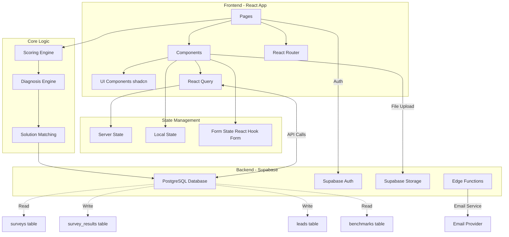
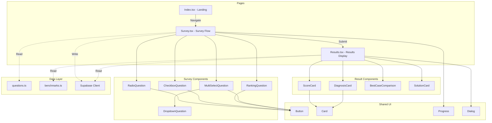

# Layer 1: 아키텍처 - 시스템 구조 및 컴포넌트 맵

> **문서 목적**: 전체 시스템의 기술 아키텍처, 디렉토리 구조, 컴포넌트 관계를 정의합니다.  
> **참조 시점**: 새로운 컴포넌트 추가, 구조 변경, 전체 구조 파악 시

---

## 1. 시스템 아키텍처

### 1.1 아키텍처 다이어그램



### 1.2 기술 스택

#### Frontend
- **Framework**: React 18.3.1 + TypeScript + Vite
- **UI Library**: shadcn/ui + Tailwind CSS
- **상태 관리**: React Query (서버 상태), useState/useReducer (로컬 상태)
- **폼 관리**: React Hook Form + Zod
- **라우팅**: React Router v6
- **Icons**: Lucide React

#### Backend
- **Database**: PostgreSQL (Supabase)
- **인증**: Supabase Auth (선택적)
- **저장소**: Supabase Storage (PDF 리포트용)
- **서버리스**: Supabase Edge Functions (이메일 발송)

#### Design System
- **컬러 시스템**: 의료 블루-그린 테마 (HSL 기반)
- **그라데이션**: Primary, Secondary, Hero 그라데이션
- **애니메이션**: Tailwind CSS Animate + Custom Transitions

---

## 2. 디렉토리 구조

```
src/
├── components/
│   ├── survey/              # 설문 관련 컴포넌트
│   │   ├── RadioQuestion.tsx
│   │   ├── CheckboxQuestion.tsx
│   │   ├── RankingQuestion.tsx
│   │   ├── MultiSelectQuestion.tsx
│   │   ├── DropdownQuestion.tsx
│   │   ├── ProgressBar.tsx
│   │   └── QuestionCard.tsx
│   ├── results/             # 결과 페이지 컴포넌트
│   │   ├── ScoreCard.tsx
│   │   ├── DiagnosisCard.tsx
│   │   ├── BestCaseComparison.tsx
│   │   └── SolutionCard.tsx
│   └── ui/                  # shadcn/ui 컴포넌트
│       └── [shadcn components]
├── lib/
│   ├── scoring/             # 점수 계산 로직
│   │   └── scoreCalculator.ts
│   ├── diagnosis/           # 진단 로직
│   │   ├── diagnosisEngine.ts
│   │   └── types.ts
│   ├── supabase/           # Supabase 클라이언트
│   │   └── client.ts
│   └── utils.ts            # 유틸리티 함수
├── pages/
│   ├── Index.tsx           # 랜딩 페이지 (/)
│   ├── Survey.tsx          # 설문 페이지 (/survey)
│   └── Results.tsx         # 결과 페이지 (/results/:id)
├── types/
│   └── survey.ts           # 타입 정의
├── data/
│   ├── questions.ts        # 질문 데이터
│   └── benchmarks.ts       # 벤치마크 데이터
├── hooks/
│   ├── use-mobile.tsx
│   └── use-toast.ts
├── index.css               # 디자인 시스템 (색상, 그라데이션, 섀도우)
└── main.tsx                # 앱 진입점
```

---

## 3. 컴포넌트 관계 다이어그램



---

## 4. 페이지 컴포넌트 정의

### 4.1 Index.tsx - 랜딩 페이지 (`/`)

**목적**: 서비스 소개 및 설문 시작 유도

**주요 섹션**:
- **Hero Section**: "3분만에 우리 병원 마케팅 진단받기" + CTA
- **Features Section**: 주요 기능 3가지 소개
- **Benefits Section**: 사용 효과 강조
- **Trust Section**: 신뢰성 요소 (고객사, 후기 등)

**핵심 기능**:
- 설문 시작 버튼 → `/survey` 이동
- 스크롤 애니메이션
- 반응형 디자인

---

### 4.2 Survey.tsx - 설문 페이지 (`/survey`)

**목적**: 10개 질문 진행 및 응답 수집

**UI 구조** (3개 영역):

#### 1) Question Header (lines 150-168)
- **Section Badge**: 현재 섹션 표시 (기본 정보/마케팅 채널/운영 관리 등)
- **Question Title**: 메인 질문 텍스트
- **Question Description**: 부연 설명

#### 2) Question Sub-header (lines 171-175)
- **Question Type Hint**: 선택 방법 안내 ("최대 2개 선택" 등)

#### 3) Question Options (lines 178+)
- **동적 렌더링**: 질문 타입에 따라 적절한 컴포넌트 렌더링
- **검증**: 실시간 입력 검증 및 에러 표시

**상태 관리**:
- `currentQuestion`: 현재 질문 인덱스
- `responses`: 전체 응답 객체
- `progress`: 진행률 (0-100%)

**조건부 로직**:
- Q2에서 "피부과/성형외과" 선택 시 → Q4-1 표시
- 기타 진료과 선택 시 → Q4-1 스킵

---

### 4.3 Results.tsx - 결과 페이지 (`/results/:id`)

**목적**: 진단 결과 표시 및 전환 유도

**데이터 흐름**:
1. URL에서 `survey_id` 추출
2. Supabase에서 `survey_results` 조회
3. 4개 엔진으로 결과 생성:
   - `calculateTotalScore()` → 점수 계산
   - `diagnoseSurvey()` → 진단 수행
   - `generateSolutions()` → 솔루션 생성
   - `simulateROI()` → ROI 예측
4. 6개 섹션 렌더링
5. 전환 액션 처리

---

#### 결과 페이지 6개 섹션 구조

##### 섹션 1: 종합 점수 카드 (Score Card)

**파일**: `Results.tsx` (L163-197)

**표시 내용**:
- **총점**: 0-100점 (원형 게이지 차트)
- **레벨**: 4단계 (초기/기본/중급/고급)
- **4개 카테고리 점수**:
  - 채널 활용도 (30점)
  - 운영 관리 (25점)
  - 성과 측정 (25점)
  - 예산 규모 (20점)
- **업종 평균 대비**: 상대 평가 점수

**동적 요소**:
- 점수에 따라 레벨 색상 변경
- 카테고리별 막대 차트 길이
- 업종 평균선 위치

**엔진**: `scoreCalculator.ts`

---

##### 섹션 2: 진단 결과 카드 (Diagnosis Card)

**파일**: `Results.tsx` (L199-263)

**표시 내용**:
- **주요 진단 유형** (Primary Issue):
  - 12가지 진단 유형 중 1개
  - 진단 제목 + 아이콘
  - 진단 설명 (1-2문장)
- **점수 산출 근거** (Score Summary):
  - primaryFactors (3개 요인)
  - interpretation (점수 해석)
- **강점 영역** (Strengths):
  - 잘하고 있는 영역 (최대 5개)
  - 각 강점별 설명

**동적 요소**:
- 12가지 진단 유형별 다른 제목/설명/아이콘
- 점수에 따라 다른 해석 메시지
- 강점 영역 개수 및 내용 변경

**엔진**: `diagnosisEngine.ts`, `issueDetectors.ts`

---

##### 섹션 3: 경쟁 환경 및 노출 순위 분석

**파일**: `CompetitionSection.tsx`

**표시 내용**:
- **경쟁 현황** (Competition Level):
  - 경쟁도: 낮음/보통/높음/매우 높음
  - 인근 경쟁 병원 수 (Q13 응답)
  - 경쟁 환경 설명 (3-4줄)
  - 색상 인디케이터 (green/yellow/orange/red)
- **노출 순위** (Search Ranking):
  - 네이버 지도 순위 (Q14 응답)
  - 순위 상태: 최상위/양호/개선필요/시급
  - 순위 설명 (3-4줄)
  - 색상 인디케이터
- **종합 우선순위** (Action Priority):
  - 경쟁도 × 순위 조합 판단
  - 우선순위: 시급/개선권장/기회/유지
  - 우선순위 이유 (2-3줄)

**동적 요소**:
- 4×5 = 20가지 조합별 다른 메시지
- 색상 및 아이콘 변경
- 우선순위 레벨에 따른 강조 스타일

**엔진**: `competitionScore.ts` (L143-282)

---

##### 섹션 4: 우리 병원 맞춤 전략 (Contextual Advice)

**파일**: `CompetitionSection.tsx` (L156-170)

**표시 내용**:
- **업종×지역×상황별 맞춤 조언**:
  - 최대 10개 조언 리스트
  - 각 조언: 아이콘 + 텍스트 (3-5줄)
  - 순서: 중요도 순

**동적 요소**:
- **10개 업종별** 다른 조언:
  - 피부과/성형외과
  - 치과
  - 정형외과
  - 내과/가정의학과
  - 산부인과/소아청소년과
  - 안과/이비인후과
  - 비뇨기과
  - 정신건강의학과/신경과
  - 기타
- **지역별** 다른 조언:
  - 강남/서초/역삼 (초경쟁 지역)
  - 광역시 중심가
  - 일반 지역
- **상황별** 다른 조언:
  - 경쟁도 (낮음/보통/높음/매우 높음)
  - 검색 순위 (최상위/양호/개선필요/시급)
  - 플랫폼 사용 여부
  - 채널 개수

**조언 조합**: 10개 업종 × 3개 지역 × 다양한 상황 = **100개 이상 조합**

**엔진**: `competitionScore.ts`의 `generateContextualAdvice()` (L289-515)

---

##### 섹션 5: 실행 체크리스트 (Checklist)

**파일**: `ChecklistSection.tsx`

**표시 내용**:
- **39개 조건 중 매칭되는 항목만 표시**:
  - 카테고리별 그룹핑:
    - 채널 (최대 12개)
    - 운영 (최대 10개)
    - 측정 (최대 9개)
    - 예산 (최대 4개)
    - 통합 (최대 4개)
  - 각 항목:
    - ✓ 체크박스 (이미 잘하고 있으면 체크됨)
    - 제목
    - 💡 팁 (상세 조언)
    - 우선순위 배지 (시급/개선권장/기회/유지)
- **우선순위 정렬**: 시급 → 개선권장 → 기회 → 유지

**동적 요소**:
- 설문 응답 조합에 따라 표시되는 항목 변경
- 우선순위 색상 (시급=red, 개선권장=orange, 기회=blue, 유지=green)
- 체크 여부

**엔진**: `checklistGenerator.ts` (39개 조건 평가)

---

##### 섹션 6: 맞춤형 개선 전략 (Solutions)

**파일**: `Results.tsx` (L273-350)

**표시 내용**:
- **3단계 솔루션**:
  1. **즉시 실행** (72시간 내, high priority):
     - 최대 3개 액션
     - 각 액션: 제목, 설명, 기간, 예상 효과
  2. **단기 개선안** (1개월 내, medium priority):
     - 최대 3개 액션
  3. **중장기 전략** (3-6개월, low priority):
     - 최대 2개 액션

**동적 요소**:
- **12가지 진단 유형별** 다른 솔루션:
  - 각 유형마다 특화된 3단계 액션
- **업종별** 미세 조정:
  - 예: 피부과 → "인스타그램 마케팅" 강조
  - 예: 치과 → "네이버 플레이스 리뷰" 강조
- **예산별** 액션 조정:
  - 예산 높음 → 광고 확대 액션
  - 예산 낮음 → 무료 채널 활용 액션

**엔진**: `actionGenerator.ts`, `actionTemplates.ts` (12개 유형 × 3단계)

---

#### 결과 페이지 데이터 플로우

```mermaid
graph LR
    A[SurveyResponse] --> B[scoreCalculator]
    B --> C[ScoreResult]
    A --> D[diagnosisEngine]
    C --> D
    D --> E[DiagnosisResult]
    A --> F[actionGenerator]
    E --> F
    F --> G[Solutions]
    A --> H[roiSimulator]
    C --> H
    H --> I[ROIProjection]
    A --> J[competitionScore]
    J --> K[CompetitionAssessment]
    A --> L[checklistGenerator]
    L --> M[ChecklistItem[]]

    C --> N[섹션 1: 점수 카드]
    E --> O[섹션 2: 진단 카드]
    K --> P[섹션 3: 경쟁 환경]
    K --> Q[섹션 4: 맞춤 전략]
    M --> R[섹션 5: 체크리스트]
    G --> S[섹션 6: 솔루션]
```

---

#### 섹션별 파일 위치

| 섹션 | 렌더링 파일 | 로직 엔진 | 라인 |
|------|-----------|----------|------|
| 1. 점수 카드 | Results.tsx | scoreCalculator.ts | L163-197 |
| 2. 진단 카드 | Results.tsx | diagnosisEngine.ts | L199-263 |
| 3. 경쟁 환경 | CompetitionSection.tsx | competitionScore.ts | 전체 |
| 4. 맞춤 전략 | CompetitionSection.tsx | competitionScore.ts | L156-170 |
| 5. 체크리스트 | ChecklistSection.tsx | checklistGenerator.ts | 전체 |
| 6. 솔루션 | Results.tsx | actionGenerator.ts | L273-350 |

---

## 5. 설문 질문 컴포넌트 정의

### 5.1 RadioQuestion.tsx

**용도**: 단일 선택 질문 (하나만 선택)

**데이터 타입**: `type: "radio"`

**사용 예시**:
- Q1: location (병원 위치)
- Q2: hospital_size (병원 규모)
- Q3: budget (마케팅 예산)

**Props**:
```typescript
interface RadioQuestionProps {
  question: Question;
  value: string | undefined;
  onChange: (value: string) => void;
  error?: string;
}
```

---

### 5.2 CheckboxQuestion.tsx

**용도**: 다중 선택 질문 (여러 개 선택 가능)

**데이터 타입**: `type: "checkbox"`

**사용 예시**:
- Q2: specialties (주요 진료 분야, 최대 2개)
- Q8: tracking_methods (신규 환자 파악 방법)
- Q9: online_status (온라인 현황)

**Props**:
```typescript
interface CheckboxQuestionProps {
  question: Question;
  value: string[] | undefined;
  onChange: (value: string[]) => void;
  error?: string;
  maxSelections?: number;  // 최대 선택 개수 제한
}
```

---

### 5.3 RankingQuestion.tsx

**용도**: 순위 매기기 질문

**데이터 타입**: `type: "ranking"`

**사용 예시**:
- Q4: top3_channels (마케팅 채널 TOP 3 순위)
- Q10: main_problems (주요 문제 순위)

**Props**:
```typescript
interface RankingQuestionProps {
  question: Question;
  value: { rank: number; option: string }[] | undefined;
  onChange: (value: { rank: number; option: string }[]) => void;
  error?: string;
  rankCount: number;  // 순위를 매길 개수 (3개, 2개 등)
}
```

---

### 5.4 MultiSelectQuestion.tsx

**용도**: 복합 선택 질문 (메인 질문 + 서브 질문)

**데이터 타입**: `type: "multiselect"`, `subQuestions` 포함

**구조**:
1. 메인 옵션 체크박스 (여러 개 선택 가능)
2. 각 선택된 옵션에 대한 서브 질문 (radio 또는 dropdown)

**사용 예시**:
- Q5: channels (채널 선택 + 각 채널별 활용도/만족도)
- Q6: content (콘텐츠 유형 선택 + 각 유형별 업데이트 주기)
- Q7: management (관리 주체 선택 + 각 주체별 만족도)

**Props**:
```typescript
interface MultiSelectQuestionProps {
  question: Question;
  value: {
    selected: string[];
    subAnswers: Record<string, string>;
  } | undefined;
  onChange: (value: { selected: string[]; subAnswers: Record<string, string> }) => void;
  error?: string;
}
```

---

### 5.5 DropdownQuestion.tsx

**용도**: 드롭다운 선택 질문

**데이터 타입**: `type: "dropdown"`

**사용처**: 주로 `MultiSelectQuestion`의 서브 질문으로 사용

**Props**:
```typescript
interface DropdownQuestionProps {
  question: Question;
  value: string | undefined;
  onChange: (value: string) => void;
  error?: string;
  placeholder?: string;
}
```

---

## 6. 질문 데이터 구조 (questions.ts)

### 6.1 질문 ID → 데이터 매핑

| Question ID | Field Name | 설명 | Type |
|-------------|------------|------|------|
| Q1 | location | 병원 위치 | radio |
| Q1 | hospital_size | 병원 규모 | radio |
| Q2 | specialties | 주요 진료 분야 (최대 2개) | checkbox |
| Q3 | budget | 월 마케팅 예산 | radio |
| Q4 | channels | 사용 중인 마케팅 채널 | checkbox |
| Q4 | top1/2/3_channel | 채널 TOP 3 순위 | ranking |
| Q4-1 | commercial_platform | 상업적 플랫폼 활용 (조건부) | radio |
| Q4-2 | channel_reason | 채널 선택 이유 | radio |
| Q4-3 | new_channel_attempt | 다른 채널 시도 경험 | radio |
| Q5 | top1_ratio | 1순위 채널 비중 | radio |
| Q5 | online_ratio | 온라인 vs 오프라인 비중 | radio |
| Q6 | update_frequency | 콘텐츠 업데이트 주기 | radio |
| Q7 | management | 마케팅 관리 주체 | radio |
| Q8 | tracking_methods | 신규 환자 파악 방법 | checkbox |
| Q9 | online_status | 온라인 현황 (긍정/부정) | checkbox |
| Q10 | main_problems | 가장 큰 문제 (최대 2개) | checkbox |

### 6.2 질문 타입별 검증 규칙

```typescript
// Radio: 단일 값 필수
validate: (value) => {
  if (!value) return "필수 선택 항목입니다.";
  return true;
}

// Checkbox: 최소 1개 이상 선택
validate: (value) => {
  if (!value || value.length === 0) return "최소 1개를 선택해주세요.";
  if (maxSelections && value.length > maxSelections) {
    return `최대 ${maxSelections}개까지 선택 가능합니다.`;
  }
  return true;
}

// Multiselect: 선택된 메인 옵션의 서브 질문 필수 응답
validate: (value) => {
  if (!value || value.selected.length === 0) {
    return "최소 1개를 선택해주세요.";
  }
  for (const option of value.selected) {
    if (!value.subAnswers[option]) {
      return `"${option}"에 대한 답변이 필요합니다.`;
    }
  }
  return true;
}

// Ranking: 지정된 개수만큼 순위 선택
validate: (value) => {
  if (!value || value.length !== rankCount) {
    return `${rankCount}개의 순위를 모두 선택해주세요.`;
  }
  return true;
}
```

---

## 7. 디자인 시스템 (index.css)

### 7.1 컬러 시스템 (HSL 기반)

```css
:root {
  /* Primary Colors - Medical Blue */
  --primary: 210 100% 50%;
  --primary-glow: 210 100% 60%;
  --primary-dark: 210 100% 40%;
  
  /* Secondary Colors - Medical Green */
  --secondary: 160 60% 45%;
  --secondary-light: 160 60% 55%;
  
  /* Accent Colors */
  --accent: 200 85% 55%;
  
  /* Gradients */
  --gradient-primary: linear-gradient(135deg, hsl(var(--primary)), hsl(var(--primary-glow)));
  --gradient-secondary: linear-gradient(135deg, hsl(var(--secondary)), hsl(var(--secondary-light)));
  --gradient-hero: linear-gradient(135deg, hsl(var(--primary)), hsl(var(--accent)));
  
  /* Shadows */
  --shadow-elegant: 0 10px 30px -10px hsl(var(--primary) / 0.3);
  --shadow-glow: 0 0 40px hsl(var(--primary-glow) / 0.4);
  
  /* Animations */
  --transition-smooth: all 0.3s cubic-bezier(0.4, 0, 0.2, 1);
}
```

### 7.2 컴포넌트 Variants (button.tsx 예시)

```typescript
const buttonVariants = cva(
  "inline-flex items-center justify-center rounded-md text-sm font-medium transition-colors",
  {
    variants: {
      variant: {
        default: "bg-primary text-primary-foreground hover:bg-primary/90",
        secondary: "bg-secondary text-secondary-foreground hover:bg-secondary/80",
        outline: "border border-input hover:bg-accent hover:text-accent-foreground",
        ghost: "hover:bg-accent hover:text-accent-foreground",
        medical: "bg-gradient-to-r from-primary to-secondary text-white shadow-lg",
      },
      size: {
        default: "h-10 px-4 py-2",
        sm: "h-9 rounded-md px-3",
        lg: "h-11 rounded-md px-8",
        icon: "h-10 w-10",
      },
    },
  }
);
```

---

## 8. 라우팅 구조

```typescript
// src/App.tsx
<Routes>
  <Route path="/" element={<Index />} />
  <Route path="/survey" element={<Survey />} />
  <Route path="/results/:id" element={<Results />} />
  <Route path="*" element={<NotFound />} />
</Routes>
```

**URL 구조**:
- `/` - 랜딩 페이지
- `/survey` - 설문 진행
- `/results/:id` - 결과 페이지 (survey_id를 URL 파라미터로 전달)

---

## 9. 상태 관리 전략

### 9.1 서버 상태 (React Query)

```typescript
// 설문 응답 저장
const saveSurveyMutation = useMutation({
  mutationFn: (data: SurveyResponse) => 
    supabase.from('surveys').insert(data),
});

// 결과 조회
const { data: result } = useQuery({
  queryKey: ['survey-result', surveyId],
  queryFn: () => 
    supabase.from('survey_results').select('*').eq('survey_id', surveyId).single(),
});
```

### 9.2 로컬 상태 (useState/useReducer)

```typescript
// Survey.tsx에서 설문 진행 상태 관리
const [currentQuestion, setCurrentQuestion] = useState(0);
const [responses, setResponses] = useState<SurveyResponse>({});
const [errors, setErrors] = useState<Record<string, string>>({});
```

### 9.3 폼 상태 (React Hook Form)

```typescript
// 이메일 수집 폼 등에서 사용
const { register, handleSubmit, formState: { errors } } = useForm({
  resolver: zodResolver(emailSchema),
});
```

---

## 10. 성능 최적화 포인트

### 10.1 코드 스플리팅
```typescript
// 페이지별 lazy loading
const Results = lazy(() => import('./pages/Results'));
```

### 10.2 이미지 최적화
- WebP 포맷 사용
- Lazy loading 적용
- 반응형 이미지 (srcset)

### 10.3 번들 최적화
- Tree shaking (ES Modules 사용)
- 불필요한 라이브러리 제거
- shadcn/ui 컴포넌트 선택적 import

---

## 11. 접근성 (a11y) 가이드라인

- **키보드 네비게이션**: Tab, Enter, Space 키 지원
- **ARIA 레이블**: 모든 폼 요소에 적절한 레이블
- **시맨틱 HTML**: `<main>`, `<section>`, `<article>` 사용
- **색상 대비**: WCAG AA 기준 충족 (4.5:1 이상)
- **Focus Styles**: 명확한 포커스 표시

---

## 변경 이력

| 날짜 | 변경 내용 | 작성자 |
|------|-----------|--------|
| 2025-01-XX | 초기 문서 작성 (3-Layer 구조 전환) | - |
