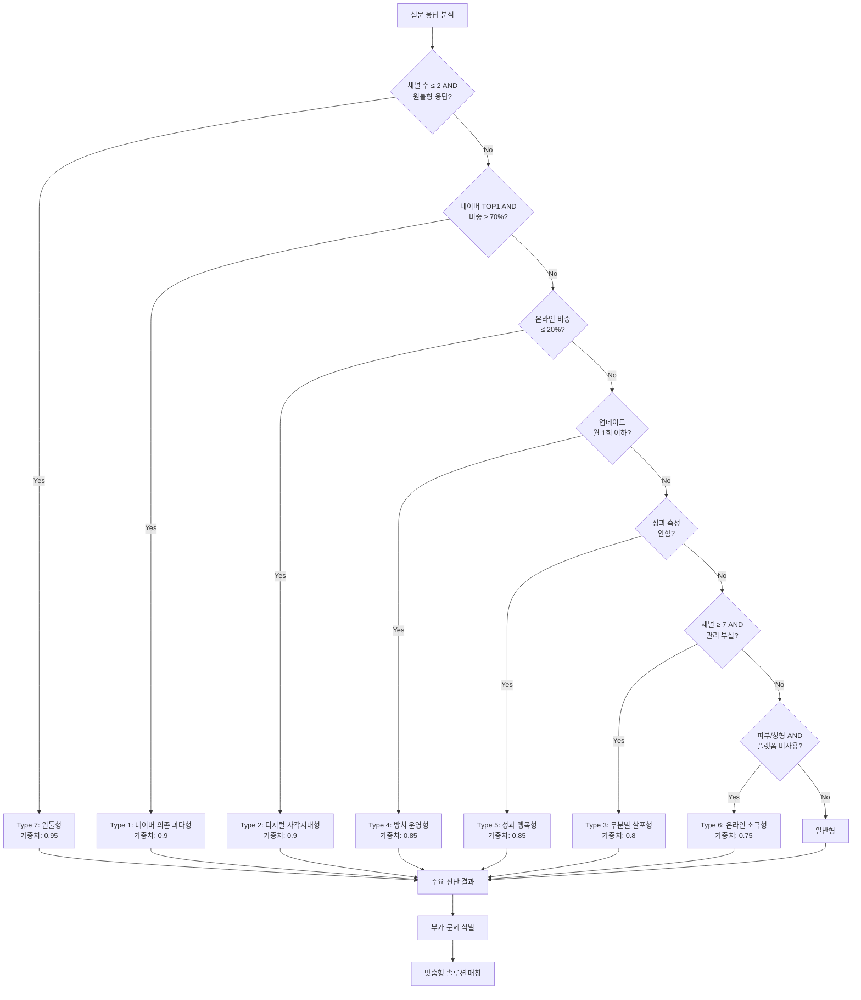
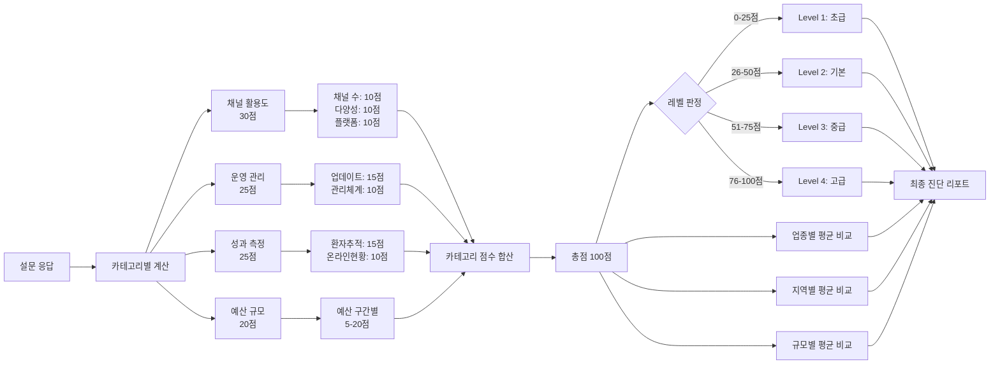

# Layer 1: 도메인 로직 - 진단 및 스코어링 시스템

> **문서 목적**: 병원 마케팅 진단의 핵심 비즈니스 로직을 정의합니다.  
> **참조 시점**: 진단 로직 수정, 스코어링 계산 변경, 새로운 진단 유형 추가 시

---

## 1. 진단 유형 정의 (12가지)

### Type 1: 네이버 의존 과다형

**정의**: 전체 마케팅의 **80% 이상**이 네이버에 집중되어 있는 상태 (2025-01-14 기준 강화)

**진단 조건**:
```typescript
// 네이버 채널 비중 80% 이상
naverChannels / totalChannels >= 0.8

// OR top1_ratio "70% 이상" + 네이버 채널만 3개 사용
top1Ratio === "70% 이상" && naverChannels >= 3 && totalChannels === naverChannels
```

**위험 요인**:
- 네이버 알고리즘 변경에 취약
- 광고 단가 상승 시 대체 채널 부재
- 경쟁 심화 시 대응 어려움

**솔루션**:
1. **즉시 실행 (72시간)**:
   - 인스타그램 비즈니스 계정 개설
   - 기존 네이버 콘텐츠 인스타그램에 재업로드
2. **단기 개선안 (1개월)**:
   - 카카오 검색광고 10% 예산 테스트
   - 의료 플랫폼 1-2곳 무료 등록
3. **중장기 전략 (3-6개월)**:
   - 네이버 비중 50% 이하로 낮추기
   - 3개 이상 채널 포트폴리오 구축

---

### Type 2: 디지털 사각지대형

**정의**: 온라인 마케팅 비중이 30% 미만인 상태

**진단 조건**:
```typescript
responses.online_ratio === '온라인 20%' ||
responses.online_ratio === '온라인 0%' ||
responses.channels.filter(c => isOnlineChannel(c)).length <= 3
```

**위험 요인**:
- 온라인에서 검색되지 않음
- 젊은 세대 환자 유입 어려움
- 경쟁병원 대비 불리

**솔루션**:
1. **즉시 실행**:
   - 네이버 플레이스 등록 및 최적화
   - 기본 정보 + 사진 10장 이상 등록
2. **단기 개선안**:
   - 월 50만원으로 네이버 검색광고 시작
   - 환자 후기 10개 이상 확보
3. **중장기 전략**:
   - 온라인 비중 60% 이상으로 확대
   - 병원 홈페이지 or 인스타그램 운영

---

### Type 3: 무분별 살포형

**정의**: 7개 이상의 채널을 사용하지만 통합 관리가 되지 않는 상태

**진단 조건**:
```typescript
responses.channels.length >= 7 &&
responses.management === '관리가_제대로_안되고_있음' &&
responses.tracking_methods.includes('따로 파악하지 않음')
```

**위험 요인**:
- 비효율적인 예산 분산
- 효과 없는 채널에 예산 낭비
- 관리 부담 과중

**솔루션**:
1. **즉시 실행**:
   - 각 채널별 월간 신규 환자 수 측정 시작
   - 스프레드시트로 간단 집계
2. **단기 개선안**:
   - 성과 하위 30% 채널 중단
   - 상위 3-4개 채널에 집중
3. **중장기 전략**:
   - 채널별 ROAS 측정 체계 구축
   - 통합 마케팅 대시보드 도입

---

### Type 4: 방치 운영형

**정의**: 콘텐츠 업데이트가 월 1회 이하로 방치된 상태

**진단 조건**:
```typescript
responses.update_frequency === '월1회이하' ||
responses.update_frequency === '거의안함'
```

**위험 요인**:
- 검색 노출 순위 하락
- 환자들에게 "운영 안 하는 병원" 인식
- 최신 정보 부족으로 신뢰도 저하

**솔루션**:
1. **즉시 실행**:
   - 주 1회 포스팅 일정 수립
   - 간단한 콘텐츠 3개 미리 준비
2. **단기 개선안**:
   - 월 8-12회 업데이트 루틴 확립
   - 템플릿 활용으로 제작 시간 단축
3. **중장기 전략**:
   - 콘텐츠 외주 or 전담 인력 고용
   - 콘텐츠 캘린더 운영

---

### Type 5: 성과 맹목형

**정의**: 마케팅 효과를 전혀 측정하지 않는 상태

**진단 조건**:
```typescript
responses.tracking_methods.includes('따로 파악하지 않음') ||
responses.tracking_methods.includes('대략적으로 추정만 함')
```

**위험 요인**:
- 효과적인 채널 vs 비효율 채널 구분 불가
- 예산 최적화 불가능
- ROI 판단 불가

**솔루션**:
1. **즉시 실행**:
   - 신규 환자 첫 방문 시 "어떻게 오셨나요?" 질문 의무화
   - 간단한 집계 시트 작성
2. **단기 개선안**:
   - 채널별 신규 환자 수 주간 리포트
   - 월 1회 채널별 성과 회의
3. **중장기 전략**:
   - UTM 파라미터 활용한 자동 추적
   - Google Analytics 연동

---

### Type 6: 온라인 마케팅 소극형

**정의**: 피부과/성형외과임에도 온라인 활동이 미흡한 상태

**진단 조건**:
```typescript
// specialties는 ranking 타입: { selected: string[], ranking: { [key: string]: number } }
// 1순위 또는 2순위에 '피부과/성형외과'가 있는 경우
// (주의: 2순위가 '피부과/성형외과'인 경우 1순위로 처리)
const selectedSpecialties = responses.specialties?.selected || [];
const hasBeautySpecialty = selectedSpecialties.includes('피부과/성형외과');

hasBeautySpecialty &&
responses.commercialPlatform === '사용하지 않음' &&
responses.onlineRatio !== '온라인 100%'
```

**위험 요인**:
- 미용 산업의 주 고객층(20-40대 여성) 접근 실패
- 경쟁 병원 대비 월등히 불리
- 온라인 평판 관리 부재

**솔루션**:
1. **즉시 실행**:
   - 강남언니 or 바비톡 무료 등록
   - Before/After 사진 5장 이상 등록
2. **단기 개선안**:
   - 플랫폼 프리미엄 광고 월 100만원 테스트
   - 인스타그램 릴스 주 3회 업로드
3. **중장기 전략**:
   - 온라인 비중 80% 이상
   - 의사 브랜딩 (유튜브 쇼츠 등)

---

### Type 7: 원툴형

**정의**: 과거 성과에 안주하며 단일 채널만 고집하는 상태

**진단 조건**:
```typescript
(responses.channels.length <= 2) &&
(responses.top1_ratio === '70% 이상') &&
(responses.channel_reason === '이전에_이_채널에서_성과가_좋았음' ||
 responses.new_channel_attempt === '지금_채널만으로_충분해서_시도할_필요_없음')
```

**위험 요인**:
- 시장 변화에 대응 불가
- 경쟁 심화 시 리스크 집중
- 새로운 환자층 유입 차단

**솔루션**:
1. **즉시 실행**:
   - 신규 채널 1개 소규모 테스트 (예산 10%)
   - 경쟁병원 채널 분석
2. **단기 개선안**:
   - 신규 채널 점진적 확대 (20% → 30%)
   - A/B 테스트로 성과 비교
3. **중장기 전략**:
   - 3개 이상 채널 포트폴리오
   - 리스크 분산 및 시너지 효과

---

## 2. 스코어링 시스템

### 2.1 점수 체계

**총점**: 100점 만점

**카테고리별 배점**:
- **채널 활용도**: 30점
- **운영 관리**: 25점
- **성과 측정**: 25점
- **예산 규모**: 20점

### 2.2 레벨 구분

| 레벨 | 점수 범위 | 설명 |
|------|-----------|------|
| Level 1 (초급) | 0-25점 | 마케팅 기반 미흡, 즉시 개선 필요 |
| Level 2 (기본) | 26-50점 | 기본은 갖췄으나 비효율 존재 |
| Level 3 (중급) | 51-75점 | 체계적 운영, 일부 최적화 필요 |
| Level 4 (고급) | 76-100점 | 선진 마케팅 체계, 벤치마크 수준 |

### 2.3 상대 평가 기준

- **업종별 평균**: 동일 진료과 병원들의 평균 점수 대비
- **지역별 평균**: 동일 지역 병원들의 평균 점수 대비
- **규모별 평균**: 동일 규모 병원들의 평균 점수 대비

---

## 3. 진단 로직 결정 트리



### 3.1 주요 문제 유형 판정 로직 (TypeScript)

```typescript
function determinePrimaryIssue(responses: SurveyResponse): DiagnosisType {
  const issues: Array<{ type: DiagnosisType; weight: number }> = [];
  
  // 1. 원툴형 체크 (최우선)
  if (
    (responses.channels?.length || 0) <= 2 &&
    responses.top1Ratio === '70% 이상' &&
    (responses.channelReason === '이전에_이_채널에서_성과가_좋았음' ||
     responses.newChannelAttempt === '지금_채널만으로_충분해서_시도할_필요_없음')
  ) {
    issues.push({ type: '원툴형', weight: 0.95 });
  }
  
  // 2. 네이버 의존도 체크
  if (
    responses.top1Channel === '네이버' &&
    responses.top1Ratio === '70% 이상'
  ) {
    issues.push({ type: '네이버_의존_과다형', weight: 0.9 });
  }
  
  // 3. 디지털 부족 체크
  if (responses.onlineRatio === '온라인 20%' || responses.onlineRatio === '온라인 0%') {
    issues.push({ type: '디지털_사각지대형', weight: 0.9 });
  }
  
  // 4. 관리 부실 체크
  if (['월1회이하', '거의안함'].includes(responses.updateFrequency || '')) {
    issues.push({ type: '방치_운영형', weight: 0.85 });
  }
  
  // 5. 측정 부재 체크
  if (responses.trackingMethods?.includes('따로 파악하지 않음')) {
    issues.push({ type: '성과_맹목형', weight: 0.85 });
  }
  
  // 6. 채널 과다 체크
  if (
    (responses.channels?.length || 0) >= 7 &&
    responses.management === '관리가_제대로_안되고_있음'
  ) {
    issues.push({ type: '무분별_살포형', weight: 0.8 });
  }
  
  // 7. 온라인 소극성 체크 (피부과/성형외과)
  // specialties는 ranking 타입이므로 selected 배열 확인
  const selectedSpecialties = responses.specialties?.selected || [];
  const hasBeautySpecialty = selectedSpecialties.includes('피부과/성형외과');
  
  if (
    hasBeautySpecialty &&
    responses.commercialPlatform === '사용하지 않음' &&
    responses.onlineRatio !== '온라인 100%'
  ) {
    issues.push({ type: '온라인_마케팅_소극형', weight: 0.75 });
  }
  
  // 가장 높은 가중치의 문제 반환
  if (issues.length > 0) {
    return issues.sort((a, b) => b.weight - a.weight)[0].type;
  }
  
  return '일반형';
}
```

---

## 4. 점수 계산 프로세스



### 4.1 카테고리별 점수 계산 상세

#### 채널 활용도 (30점)

**1) 사용 채널 수 (10점)**
```typescript
function calculateChannelCountScore(channelCount: number): number {
  if (channelCount >= 3 && channelCount <= 5) return 10; // 최적
  if (channelCount === 2) return 7;
  if (channelCount === 1) return 3;
  if (channelCount >= 6) return 5; // 관리 부담
  return 0;
}
```

**2) 채널 다양성 (10점)**
```typescript
function calculateChannelDiversityScore(onlineRatio: string): number {
  const balancedRatios = ['온라인 60%', '온라인 40%'];
  if (balancedRatios.includes(onlineRatio)) return 10; // 균형
  
  const skewedRatios = ['온라인 80%', '온라인 20%'];
  if (skewedRatios.includes(onlineRatio)) return 5; // 편중
  
  return 0; // 극단적 (100% or 0%)
}
```

**3) 플랫폼 활용도 (10점)** - 피부과/성형외과만
```typescript
function calculatePlatformScore(commercialPlatform: string): number {
  if (commercialPlatform === '유료 광고 적극 활용 중') return 10;
  if (commercialPlatform === '기본 정보만 등록') return 5;
  return 0; // 미사용
}
```

---

#### 운영 관리 (25점)

**1) 업데이트 주기 (15점)**
```typescript
function calculateUpdateFrequencyScore(frequency: string): number {
  const scoreMap: Record<string, number> = {
    '주 5회 이상': 15,
    '주 2-3회': 12,
    '주 1회': 9,
    '월 2-3회': 6,
    '월 1회 이하': 3,
    '거의 안함': 0,
  };
  return scoreMap[frequency] || 0;
}
```

**2) 관리 체계 (10점)**
```typescript
function calculateManagementScore(management: string): number {
  const scoreMap: Record<string, number> = {
    '마케팅 전담 직원 있음': 10,
    '외부 업체에 전체 위탁': 8,
    '일부는 직접, 일부는 외부': 8,
    '직원이 다른 업무와 함께': 5,
    '원장/병원장이 직접': 3,
    '관리가 제대로 안되고 있음': 0,
  };
  return scoreMap[management] || 0;
}
```

---

#### 성과 측정 (25점)

**1) 신규 환자 추적 (15점)**
```typescript
function calculateTrackingScore(methods: string[]): number {
  if (methods.includes('온라인 예약 시스템으로 자동 집계')) return 15;
  
  const manualMethods = [
    '첫 방문 시 "어떻게 오셨나요?" 질문',
    '전화 예약 시 확인',
    '특정 이벤트/쿠폰으로 추적',
  ];
  if (methods.some(m => manualMethods.includes(m))) return 10;
  
  if (methods.includes('대략적으로 추정만 함')) return 5;
  if (methods.includes('따로 파악하지 않음')) return 0;
  
  return 0;
}
```

**2) 온라인 현황 파악 (10점)**
```typescript
function calculateOnlineStatusScore(
  positive: string[],
  negative: string[]
): number {
  const positiveCount = positive.length;
  const hasNegative = negative.length > 0;
  
  if (positiveCount >= 4) return 10;
  if (positiveCount === 2 || positiveCount === 3) return 7;
  if (positiveCount === 1) return 4;
  if (hasNegative && positiveCount === 0) return 0;
  
  return 0;
}
```

---

#### 예산 규모 (20점)

```typescript
function calculateBudgetScore(budget: string): number {
  const scoreMap: Record<string, number> = {
    '2,000만원 이상': 20,
    '1,000-2,000만원': 17,
    '500-1,000만원': 14,
    '300-500만원': 11,
    '100-300만원': 8,
    '100만원 미만': 5,
    '정확히 모르겠음': 3,
  };
  return scoreMap[budget] || 0;
}
```

---

### 4.2 총점 계산 함수

```typescript
function calculateTotalScore(responses: SurveyResponse): ScoreResult {
  const channelScore = 
    calculateChannelCountScore(responses.channels?.length || 0) +
    calculateChannelDiversityScore(responses.onlineRatio || '') +
    (responses.specialties?.selected?.includes('피부과/성형외과')
      ? calculatePlatformScore(responses.commercialPlatform || '')
      : 10); // 일반 진료과는 기본 10점
  
  const operationScore =
    calculateUpdateFrequencyScore(responses.updateFrequency || '') +
    calculateManagementScore(responses.management || '');
  
  const measurementScore =
    calculateTrackingScore(responses.trackingMethods || []) +
    calculateOnlineStatusScore(
      responses.onlineStatusPositive || [],
      responses.onlineStatusNegative || []
    );
  
  const budgetScore = calculateBudgetScore(responses.budget || '');
  
  const totalScore = channelScore + operationScore + measurementScore + budgetScore;
  
  return {
    totalScore: totalScore,
    categoryScores: {
      channel: channelScore,
      operation: operationScore,
      measurement: measurementScore,
      budget: budgetScore,
    },
    level: determineLevel(totalScore),
    levelName: getLevelName(determineLevel(totalScore)),
  };
}

function determineLevel(totalScore: number): number {
  if (totalScore <= 25) return 1;
  if (totalScore <= 50) return 2;
  if (totalScore <= 75) return 3;
  return 4;
}
```

---

## 5. 부가 문제 식별

주요 문제 외에 다음 조건을 만족하면 부가 문제로 표시:

```typescript
function identifySecondaryIssues(scores: ScoreResult): string[] {
  const issues: string[] = [];
  
  if (scores.channel_score < 20) {
    issues.push('채널 다각화 필요');
  }
  
  if (scores.operation_score < 15) {
    issues.push('운영 체계 미흡');
  }
  
  if (scores.measurement_score < 15) {
    issues.push('측정 체계 부재');
  }
  
  if (scores.budget_score < 10) {
    issues.push('투자 확대 필요');
  }
  
  return issues;
}
```

---

## 6. BEST CASE 비교 로직

### 6.1 유사 병원 매칭

```typescript
async function findBestCase(responses: SurveyResponse): Promise<BestCase | null> {
  // 업종, 지역, 규모가 유사한 성공 사례 검색
  const { data: similarCases } = await supabase
    .from('benchmarks')
    .select('*')
    .eq('specialty', responses.specialties[0])
    .eq('location', responses.location)
    .order('best_case_score', { ascending: false })
    .limit(1);
  
  if (similarCases && similarCases.length > 0) {
    return similarCases[0];
  }
  
  return null;
}
```

### 6.2 격차 분석

```typescript
function calculateGap(
  currentScore: ScoreResult,
  bestCase: BestCase
): GapAnalysis {
  return {
    total_gap: bestCase.best_case_score - currentScore.total_score,
    channel_gap: calculatePercentageGap(
      currentScore.channel_score,
      bestCase.best_case_metrics.channel_score
    ),
    operation_gap: calculatePercentageGap(
      currentScore.operation_score,
      bestCase.best_case_metrics.operation_score
    ),
    measurement_gap: calculatePercentageGap(
      currentScore.measurement_score,
      bestCase.best_case_metrics.measurement_score
    ),
  };
}

function calculatePercentageGap(current: number, target: number): number {
  return ((target - current) / target) * 100;
}
```

---

## 7. ROI 시뮬레이션

### 7.1 기대 효과 계산

```typescript
function simulateROI(
  currentState: ScoreResult,
  improvementPlan: ImprovementPlan
): ROISimulation {
  const baseline = {
    monthly_patients: estimateMonthlyPatients(currentState.total_score),
    cac: estimateCAC(currentState.budget_score),
    conversion_rate: estimateConversionRate(currentState.measurement_score),
  };
  
  // 3개월 후 예상 (30% 증가)
  const month3 = {
    monthly_patients: Math.round(baseline.monthly_patients * 1.3),
    cac: Math.round(baseline.cac * 0.85),
    conversion_rate: baseline.conversion_rate * 1.2,
  };
  
  // 6개월 후 예상 (60% 증가)
  const month6 = {
    monthly_patients: Math.round(baseline.monthly_patients * 1.6),
    cac: Math.round(baseline.cac * 0.7),
    conversion_rate: baseline.conversion_rate * 1.4,
  };
  
  return { baseline, month_3: month3, month_6: month6 };
}

// 점수 기반 월간 환자 수 추정
function estimateMonthlyPatients(totalScore: number): number {
  if (totalScore >= 76) return 300;
  if (totalScore >= 51) return 200;
  if (totalScore >= 26) return 100;
  return 50;
}
```

### 7.2 기회비용 계산

```typescript
function calculateOpportunityCost(
  currentScore: number,
  bestCaseScore: number,
  avgPatientValue: number
): OpportunityCost {
  const currentPatients = estimateMonthlyPatients(currentScore);
  const bestCasePatients = estimateMonthlyPatients(bestCaseScore);
  
  const performanceGap = (bestCasePatients - currentPatients) / currentPatients;
  
  const monthlyLoss = currentPatients * performanceGap * avgPatientValue;
  const annualLoss = monthlyLoss * 12;
  
  return {
    monthly: Math.round(monthlyLoss),
    annual: Math.round(annualLoss),
    gap_percentage: Math.round(performanceGap * 100),
  };
}
```

---

## 8. 업종×지역 특성 매칭

```typescript
function getMarketCharacteristics(
  location: string,
  specialty: string
): MarketCharacteristics {
  const marketMap: Record<string, MarketCharacteristics> = {
    '서울 강남권_피부과/성형외과': {
      competition: '초고경쟁',
      key_channels: ['미용플랫폼', '인스타그램', '네이버'],
      avg_budget: '500-1000만원',
      critical_success_factor: '차별화된 브랜딩',
    },
    '서울 강남권_치과': {
      competition: '고경쟁',
      key_channels: ['네이버', '인스타그램', '유튜브'],
      avg_budget: '300-500만원',
      critical_success_factor: '전문성 강조',
    },
    // ... 더 많은 조합
  };
  
  const key = `${location}_${specialty}`;
  return marketMap[key] || getDefaultCharacteristics();
}

function getDefaultCharacteristics(): MarketCharacteristics {
  return {
    competition: '중경쟁',
    key_channels: ['네이버', '병원 홈페이지'],
    avg_budget: '200-400만원',
    critical_success_factor: '지역 기반 마케팅',
  };
}
```

---

## 8. 새로운 진단 유형 5가지 (2025-01-14 추가)

### Type 8: 콘텐츠 마케팅 미활용형

**대상 업종**: 피부과/성형외과, 비뇨기과, 정신과
**정의**: 신뢰와 후기가 중요한 업종에서 유튜브/인스타그램 콘텐츠 마케팅 미활용

**진단 조건**:
```typescript
// 대상 업종 + 유튜브/인스타그램 둘 다 미사용
targetSpecialties.includes(specialty) && !hasYoutube && !hasInstagram

// OR 대상 업종 + 채널은 있지만 업데이트 월 1회 이하
targetSpecialties.includes(specialty) && (hasYoutube || hasInstagram) &&
updateFrequency in ["월 1회 이하", "거의 안함"]
```

**핵심 메시지**: "영상 콘텐츠로 전문성과 신뢰를 보여주세요"

**솔루션**:
1. 유튜브 쇼츠/인스타그램 릴스부터 시작
2. 진료 사례, 시술 과정 소개
3. 의료진 소개 및 전문성 어필

---

### Type 9: 검색 랭킹 최적화 필요형

**대상 업종**: 정형외과, 내과/가정의학과, 치과
**정의**: 경쟁 치열 + 네이버 지도 검색 순위 낮음

**진단 조건**:
```typescript
targetSpecialties.includes(specialty) &&
(competition_count === "많음" || competition_count === "매우 많음") &&
(naver_map_ranking === "2페이지" || naver_map_ranking === "3페이지 이후")
```

**핵심 메시지**: "1페이지 진입은 쉽지 않지만, 목표로 삼고 체계적인 SEO 전략을 수립하세요"

**솔루션**:
1. 네이버 플레이스 정보 완벽 작성 (사진 30장 이상)
2. 블로그 키워드 전략 수립
3. 리뷰 관리 및 응답
4. 네이버 예약 시스템 활용

---

### Type 10: 플랫폼 확장 필요형

**대상**: 피부과/성형외과 + 강남/광역시
**정의**: 미용 시장에서 상업적 플랫폼 미활용

**진단 조건**:
```typescript
specialties.includes("피부과/성형외과") &&
(location.includes("강남") || location.includes("광역시")) &&
commercialPlatform === "관심 없음"
```

**핵심 메시지**: "미용 플랫폼 테스트로 신규 고객을 확보하세요"

**솔루션**:
1. 강남언니/모두닥 무료 등록
2. 소액 테스트 광고 (월 50만원)
3. ROI 검증 후 확대

---

### Type 11: 지역 밀착 마케팅 부족형

**대상 업종**: 소아과, 내과/가정의학과, 안과, 이비인후과
**대상 지역**: 서울 비강남권, 경기/인천, 그 외 지역
**정의**: 로컬 SEO 및 지역 마케팅 미흡

**진단 조건**:
```typescript
(targetSpecialties.includes(specialty) || isNonGangnamLocation) &&
(!hasGBP || !hasNaverPlace || naver_map_ranking === "확인 안함")
```

**핵심 메시지**: "동네 환자를 잡으려면 지도 검색부터 잡으세요"

**동적 코멘트**:
- 검색광고 미사용/비중 낮음 → "네이버/카카오 검색광고로 지역 내 노출 강화"
- 네이버 예약 미사용 → "네이버 예약으로 전환율 향상"
- 카카오맵 미사용 → "카카오맵/카카오톡 예약 활용"

**솔루션**:
1. 구글 비즈니스 프로필(GBP) + 네이버 플레이스 등록
2. 지역명 + 진료과 키워드 최적화
3. 네이버/카카오 검색광고 (지역 타겟팅)
4. 예약 시스템 연동

---

### Type 12: 예산 대비 효율 저하형

**대상**: 월 예산 500만원 이상
**정의**: 충분한 예산이지만 성과 측정이나 채널 분산 미흡

**진단 조건**:
```typescript
budget in ["500-1,000만원", "1,000-2,000만원", "2,000만원 이상"] &&
(trackingMethods.length <= 1 || top1Ratio === "70% 이상")
```

**핵심 메시지**: "예산을 쓰는 만큼 성과를 측정하고 분산하세요"

**솔루션**:
1. 채널별 UTM 파라미터 설정
2. 전화번호 분리 (채널별 070 번호)
3. 광고비 대비 신규 환자 수 측정
4. 채널 분산: 주력 50% + 테스트 30% + 예비 20%

---

## 9. 경쟁 환경 및 검색 노출 평가 (2025-01-14 추가)

### 9.1 개요

**중요**: 경쟁도(시장 환경)와 검색 노출 순위(성과 지표)는 **별도로 평가**됩니다.

- **경쟁 환경** (Q13): 인근 경쟁 병원 수 기반 시장 환경 지표
- **검색 노출 순위** (Q14): 네이버 지도에서의 병원 검색 순위 (성과 지표)

### 9.2 경쟁 환경 평가 로직

```typescript
function evaluateCompetitionLevel(competition_count?: string) {
  switch (competition_count) {
    case '거의 없음':  // 0-2개
      return { level: '낮음', color: 'green', description: '경쟁이 적은 환경. 시장 선점 기회' };

    case '보통':  // 3-5개
      return { level: '보통', color: 'yellow', description: '적정 경쟁 환경. 차별화 전략 필요' };

    case '많음':  // 6-10개
      return { level: '높음', color: 'orange', description: '치열한 경쟁. 적극적 마케팅 필수' };

    case '매우 많음':  // 10개 이상
      return { level: '매우 높음', color: 'red', description: '초경쟁 환경. 전문적 마케팅 전략 필요' };

    default:
      return { level: '알 수 없음', color: 'gray', description: '경쟁 환경 파악 권장' };
  }
}
```

### 9.3 검색 노출 순위 평가 로직

```typescript
function evaluateSearchRanking(naver_map_ranking?: string) {
  switch (naver_map_ranking) {
    case '최상위':  // 1-5위
      return { rank: '최상위', color: 'green', description: '우수한 검색 노출. 현재 전략 유지' };

    case '1페이지':
      return { rank: '양호', color: 'yellow', description: '양호한 노출. 상위권 진입 목표' };

    case '2페이지':
      return { rank: '개선 필요', color: 'orange', description: '노출 개선 필요. SEO 최적화 시작' };

    case '3페이지 이후':
      return { rank: '시급', color: 'red', description: '매우 낮은 노출. 즉시 개선 필요' };

    default:
      return { rank: '알 수 없음', color: 'gray', description: '검색 순위 확인 권장' };
  }
}
```

### 9.4 종합 우선순위 결정 로직

```typescript
function determineActionPriority(
  competitionLevel: string,
  searchRank: string
): ActionPriority {
  const isHighCompetition = competitionLevel === '높음' || competitionLevel === '매우 높음';
  const isLowRanking = searchRank === '개선 필요' || searchRank === '시급';

  // 시급: 경쟁 치열 + 노출 낮음
  if (isHighCompetition && isLowRanking) {
    return {
      priority: '시급',
      reason: '경쟁이 치열한 지역에서 노출 순위가 낮아 즉각적 조치 필요. 검색 최적화와 차별화 전략을 동시 진행하세요.'
    };
  }

  // 개선권장: 경쟁 치열 OR 노출 낮음
  if (isHighCompetition || isLowRanking) {
    if (isHighCompetition && !isLowRanking) {
      return {
        priority: '개선권장',
        reason: '치열한 경쟁 환경. 현재 노출을 유지하며 차별화 전략 강화 필요.'
      };
    }
    return {
      priority: '개선권장',
      reason: '경쟁이 심하지 않은 환경에서 노출 낮음. SEO 개선만으로도 큰 효과 가능.'
    };
  }

  // 유지: 양호한 상태
  return {
    priority: '유지',
    reason: '경쟁 환경과 노출 순위 양호. 지속적 모니터링과 현재 전략 유지.'
  };
}
```

---

## 10. 업종별 특성 기반 맥락적 분석 (2025-01-14 추가)

### 10.1 개요

병원 마케팅은 업종과 지역에 따라 전략이 크게 달라집니다. 동일한 경쟁 환경이라도 업종별로 해석이 다르며, 지역의 중요도도 다릅니다.

**핵심 원칙**:
- 업종별 마케팅 중요도, 거리 민감도, 입소문 의존도가 다름
- 성형/피부/비뇨기과는 지역(강남 vs 비강남) 구분이 중요
- 나머지 업종은 지역보다 업종 특성이 더 중요

### 10.2 업종별 특성 정의

```typescript
interface SpecialtyCharacteristics {
  marketingImportance: '낮음' | '중간' | '높음' | '매우 높음';   // 마케팅 중요도
  distanceSensitivity: '낮음' | '중간' | '높음';                // 거리 민감도
  wordOfMouthDependency: '낮음' | '중간' | '높음' | '매우 높음'; // 입소문 의존도
  locationRelevance: boolean;                                    // 지역 구분의 중요도
}
```

| 업종 | 마케팅 중요도 | 거리 민감도 | 입소문 의존도 | 지역 구분 | 핵심 특징 |
|------|-------------|------------|-------------|----------|----------|
| **치과** | 중간 | 중간 | 중간 | ❌ | 지역 분포 중상, 라이프사이클 마케팅 효과적 |
| **내과/가정의학과** | 낮음 | 높음 | 낮음 | ❌ | 워크인 비중 높음, 거리가 매우 중요 (500m 내 60-70%) |
| **정형외과** | 중간 | 중간 | 중간 | ❌ | 경쟁 치열, 특화 분야 브랜딩 중요 |
| **소아과** | 낮음 | 높음 | 매우 높음 | ❌ | 초경쟁이지만 마케팅보다 입소문 중요 |
| **비뇨기과** | 높음 | 낮음 | 매우 높음 | ✅ | 프라이버시 중요, 환자가 거리를 두고 방문 |
| **피부과/성형외과** | 매우 높음 | 낮음 | 높음 | ✅ | 초경쟁, 환자가 거리 관계없이 방문, 플랫폼/브랜딩 핵심 |
| **한의원** | 높음 | 중간 | 중간 | ❌ | 분포도 높음, 특화 진료 차별화 필요 |
| **안과** | 중간 | 높음 | 중간 | ❌ | 지역 밀착형, 지도 검색 중요 |
| **이비인후과** | 중간 | 높음 | 중간 | ❌ | 지역 밀착형, 지도 검색 중요 |
| **정신과** | 높음 | 낮음 | 높음 | ❌ | 프라이버시와 신뢰 중요, 콘텐츠 마케팅 효과적 |

### 10.3 업종×지역 맥락적 조언 생성 로직

```typescript
function generateContextualAdvice(responses: SurveyResponse): string[] {
  const advice: string[] = [];
  const primarySpecialty = responses.specialties?.selected[0];
  const location = responses.location_and_size?.location || '';
  const isGangnam = location.includes('강남');
  const isMetro = location.includes('광역시');

  // 업종별 특성 기반 조언 생성
  const characteristics = SPECIALTY_CHARACTERISTICS[primarySpecialty];

  // 1. 성형/피부과 - 지역에 따라 전략 달라짐
  if (primarySpecialty === '피부과/성형외과') {
    if (isGangnam || isMetro) {
      advice.push('💡 강남/광역시 미용 시장은 초경쟁 지역입니다. 네이버 플레이스 랭킹에 너무 집착하지 마세요. 대신 상업적 플랫폼(강남언니, 모두닥)과 브랜딩에 집중하세요.');
    } else {
      advice.push('📍 지역 기반 마케팅이 중요합니다. 네이버 플레이스 최적화와 지역 내 브랜딩을 우선하세요.');
    }
  }

  // 2. 내과/가정의학과 - 거리 민감도 높음
  if (primarySpecialty === '내과/가정의학과') {
    advice.push('🏥 내과/가정의학과는 워크인 비중이 높고 거리가 매우 중요합니다. 반경 500m 내 환자가 60-70%를 차지합니다.');

    if (!isGangnam) {
      advice.push('📍 네이버 플레이스 랭킹이 매우 중요합니다. 지도 검색 1페이지 진입을 최우선 목표로 하세요.');
    }
  }

  // 3. 소아과 - 입소문 최우선
  if (primarySpecialty === '소아과') {
    advice.push('👶 소아과는 입소문이 가장 중요합니다. 마케팅보다 진료 만족도와 후기 관리에 집중하세요.');

    if (competitionCount === '매우 많음') {
      advice.push('💡 경쟁은 치열하지만 과도한 마케팅 투자는 지양하세요. 네이버 플레이스 평점 관리와 지역 커뮤니티 평판이 핵심입니다.');
    }
  }

  // 4. 비뇨기과 - 신뢰와 유튜브
  if (primarySpecialty === '비뇨기과') {
    advice.push('🔐 비뇨기과는 프라이버시가 중요하여 환자들이 거리를 두고 방문합니다. 지역보다 신뢰 구축이 우선입니다.');

    if (!channels.includes('유튜브')) {
      advice.push('📹 유튜브로 전문성을 보여주세요. 비뇨기과는 익명성과 전문가 신뢰가 결합된 유튜브 마케팅이 매우 효과적입니다.');
    }
  }

  // ... 기타 업종별 조언

  return advice;
}
```

### 10.4 주요 업종별 맥락적 조언 예시

#### 성형외과/피부과 (강남/광역시)

```
💡 강남/광역시 미용 시장은 초경쟁 지역입니다. 네이버 플레이스 랭킹에 너무 집착하지 마세요. 대신 상업적 플랫폼(강남언니, 모두닥)과 브랜딩에 집중하세요.

🎯 강남언니, 모두닥 등 플랫폼에서 테스트를 시작하세요. 지도 검색보다 플랫폼 후기가 더 중요합니다.

📱 인스타그램과 유튜브는 필수입니다. 시술 전후 사진과 전문성을 보여주는 영상 콘텐츠로 신뢰를 구축하세요.
```

#### 내과/가정의학과 (비강남)

```
🏥 내과/가정의학과는 워크인 비중이 높고 거리가 매우 중요합니다. 반경 500m 내 환자가 60-70%를 차지합니다.

📍 네이버 플레이스 랭킹이 매우 중요합니다. 지도 검색 1페이지 진입을 최우선 목표로 하세요.

⚠️ 현재 검색 노출이 낮습니다. 네이버 스마트플레이스 정보 보강, 리뷰 관리, 정기 포스팅으로 즉시 개선하세요.

💰 네이버 검색광고로 '강남역 내과', '○○동 가정의학과' 등 지역 키워드를 선점하세요.
```

#### 소아과

```
👶 소아과는 입소문이 가장 중요합니다. 마케팅보다 진료 만족도와 후기 관리에 집중하세요.

💡 경쟁은 치열하지만 과도한 마케팅 투자는 지양하세요. 네이버 플레이스 평점 관리와 지역 커뮤니티 평판이 핵심입니다.

🏘️ 반경 700m 내 지역 밀착 마케팅에 집중하세요. 네이버 플레이스와 카카오맵 정보를 꼼꼼히 관리하세요.
```

#### 비뇨기과

```
🔐 비뇨기과는 프라이버시가 중요하여 환자들이 거리를 두고 방문합니다. 지역보다 신뢰 구축이 우선입니다.

📹 유튜브로 전문성을 보여주세요. 비뇨기과는 익명성과 전문가 신뢰가 결합된 유튜브 마케팅이 매우 효과적입니다.

⭐ 후기와 입소문이 매우 중요합니다. 만족도 높은 환자의 자발적 추천을 유도할 수 있는 경험을 제공하세요.
```

#### 치과

```
🦷 치과는 라이프사이클 마케팅이 효과적입니다. 첫 방문 후 정기 검진으로 이어지는 관계를 구축하세요.

🎯 경쟁이 치열한 지역입니다. 특화 진료(임플란트, 교정, 심미) 중 하나를 선택하여 브랜딩하세요.

📅 네이버 예약 시스템을 도입하세요. 예약 편의성이 전환율을 크게 높입니다.
```

### 10.5 조언 생성 우선순위

조언은 다음 순서로 생성됩니다:

1. **업종별 핵심 특성** (필수)
2. **지역 특성 반영** (locationRelevance가 true인 경우만)
3. **경쟁 환경 기반 조언**
4. **채널 미활용 지적**
5. **검색 순위 기반 조언**
6. **공통 개선 사항**

### 10.6 검증 기준

**연구 기반 검증** (2025-01-14):
- ✅ 내과/가정의학과 거리 민감도: 반경 500m 내 60-70% (출처: 병원 마케팅 연구)
- ✅ 성형/피부과 플랫폼 중요성: 2025년 신뢰 경쟁 전환 (출처: 병원 마케팅 트렌드)
- ✅ 치과 지역 타겟팅 효과성: 로컬 SEO 중요도 검증 (출처: 치과 마케팅 분석)

---

## 11. 동적 체크리스트 생성 (2025-01-14 추가)

### 11.1 개요

설문 응답 조합에 따라 **39개의 액션 아이템**을 동적으로 생성합니다.

**구성**:
- 채널 관련: 12개
- 운영 관련: 10개
- 측정 관련: 9개
- 예산 관련: 4개
- 통합 조건: 4개 (조합 조건)

### 11.2 체크리스트 항목 구조

```typescript
interface ChecklistItem {
  id: string;
  category: '채널' | '운영' | '측정' | '예산' | '통합';
  title: string;                    // 체크리스트 제목
  description: string;               // 현재 상태 설명
  priority: '시급' | '개선권장' | '기회' | '유지';
  tip: string;                       // 실행 가능한 구체적 팁
  checked: boolean;                  // 기본 체크 상태 (강점은 true)
}
```

### 11.3 우선순위 정렬 순서

```typescript
const priorityOrder = {
  시급: 1,       // 즉시 조치 필요
  개선권장: 2,   // 빠른 시일 내 개선 권장
  기회: 3,       // 선택적 개선 기회
  유지: 4        // 현재 상태 유지
};
```

### 11.4 주요 체크리스트 예시

#### 채널 관련 체크리스트

```typescript
// 예시 1: 채널 수 부족 (시급)
if (channels.selected.length <= 2) {
  checklist.push({
    category: '채널',
    title: '마케팅 채널 확장',
    description: '현재 1-2개의 채널만 사용하고 있습니다.',
    priority: '시급',
    tip: '최소 3개 이상의 채널을 운영하세요. 네이버 블로그, 인스타그램, 구글 비즈니스 프로필(GBP)을 기본으로 시작하는 것을 권장합니다.',
    checked: false
  });
}

// 예시 2: 네이버 블로그 활성화 (유지)
if (
  channels.selected.includes('네이버 블로그') &&
  ['주 5회 이상', '주 2-3회'].includes(updateFrequency)
) {
  checklist.push({
    category: '채널',
    title: '네이버 블로그 꾸준한 발행',
    description: '네이버 블로그를 사용 중이며 주 2회 이상 업데이트하고 있습니다.',
    priority: '유지',
    tip: '현재 주기를 유지하며 검색 키워드를 분석하여 콘텐츠 품질을 개선하세요.',
    checked: true
  });
}
```

#### 통합 조건 체크리스트 (조합)

```typescript
// 예시: 경쟁 치열 + 노출 낮음 (시급)
if (
  (competition_count === '많음' || competition_count === '매우 많음') &&
  (naver_map_ranking === '2페이지' || naver_map_ranking === '3페이지 이후')
) {
  checklist.push({
    category: '통합',
    title: '검색 노출 최적화 긴급 대응',
    description: '경쟁이 치열한 지역인데 검색 노출이 낮습니다.',
    priority: '시급',
    tip: '네이버 플레이스 정보를 완벽하게 채우고(사진 30장 이상, 리뷰 관리), 블로그 키워드 전략을 재검토하세요. 필요시 전문 SEO 대행사의 도움을 받으세요.',
    checked: false
  });
}
```

### 11.5 체크리스트 검증 규칙

**중요**: 모든 체크리스트 조건은 설문을 통해 수집 가능한 데이터만 사용합니다.

- ✅ 사용 가능: `channels.selected`, `updateFrequency`, `trackingMethods`, `budget`, `management` 등
- ❌ 사용 불가: GA 설치 여부, 전환 추적 코드, 팔로워 수 세부 값, 리뷰 수 세부 값 등

### 11.6 카테고리별 체크리스트 수

| 카테고리 | 항목 수 | 주요 검증 영역 |
|---------|--------|---------------|
| 채널 | 12개 | 채널 수, 업데이트 빈도, 플랫폼 활용 |
| 운영 | 10개 | 관리 주체, 실험 문화, 채널 비중 |
| 측정 | 9개 | 추적 체계, 데이터 기반 의사결정, LTV 인식 |
| 예산 | 4개 | 예산 규모별 적정성 |
| 통합 | 4개 | 경쟁+노출, 채널+추적, 예산+추적 조합 |

---

## 변경 이력

| 날짜 | 변경 내용 | 작성자 |
|------|-----------|--------|
| 2025-01-14 (v3) | **업종별 맥락적 분석 추가**: 업종별 특성 정의 (10개 업종), 마케팅 중요도/거리 민감도/입소문 의존도 파라미터화, 지역 구분 로직(성형/피부/비뇨기과만), 업종×지역 조합별 동적 조언 생성 (9개 업종별 시나리오), 연구 기반 검증 (내과 500m 권역, 성형 플랫폼 전환, 치과 로컬 SEO) | Claude Code |
| 2025-01-14 (v2) | **진단 시스템 대폭 개선**: 새 진단 유형 5개 추가 (콘텐츠 마케팅 미활용형, 검색 랭킹 최적화 필요형, 플랫폼 확장 필요형, 지역 밀착 마케팅 부족형, 예산 대비 효율 저하형), 네이버 의존 과다형 기준 80%로 강화, 체크리스트 UI 간소화 | Claude Code |
| 2025-01-14 (v1) | 경쟁 환경 평가 로직, 동적 체크리스트 생성 로직 추가, 비뇨기과 진료 분야 추가 | Claude Code |
| 2025-01-XX | 초기 문서 작성 (3-Layer 구조 전환) | - |
