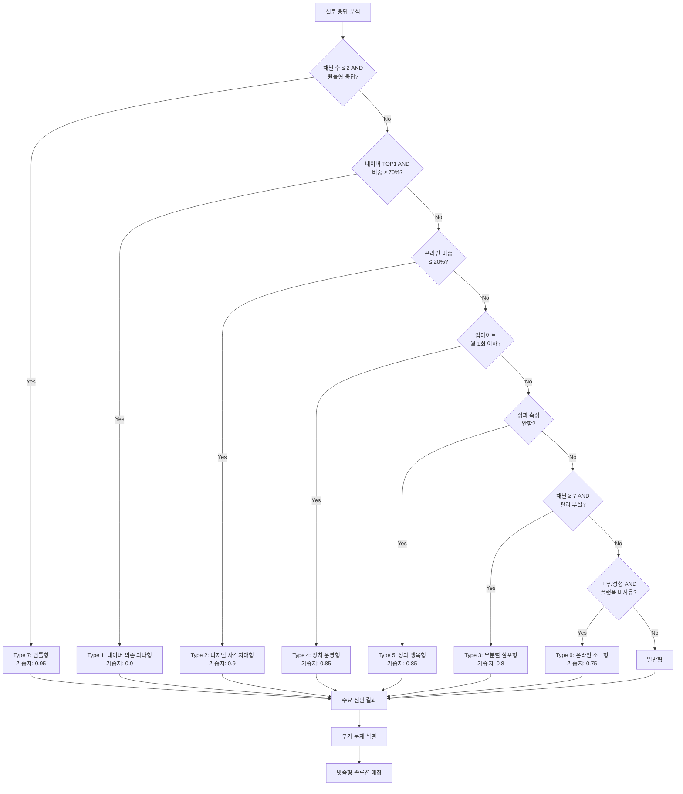
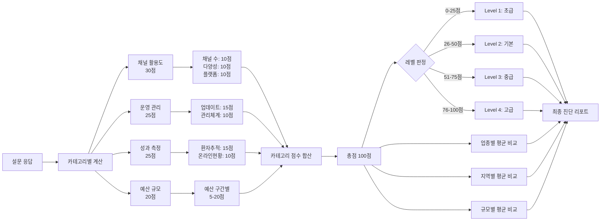

# Layer 1: 도메인 로직 - 진단 및 스코어링 시스템

> **문서 목적**: 병원 마케팅 진단의 핵심 비즈니스 로직을 정의합니다.  
> **참조 시점**: 진단 로직 수정, 스코어링 계산 변경, 새로운 진단 유형 추가 시

---

## 1. 진단 유형 정의 (7가지)

### Type 1: 네이버 의존 과다형

**정의**: 전체 마케팅의 70% 이상이 네이버에 집중되어 있는 상태

**진단 조건**:
```typescript
responses.top1_channel === '네이버' && 
responses.top1_ratio === '70% 이상'
```

**위험 요인**:
- 네이버 알고리즘 변경에 취약
- 광고 단가 상승 시 대체 채널 부재
- 경쟁 심화 시 대응 어려움

**솔루션**:
1. **즉시 실행 (72시간)**:
   - 인스타그램 비즈니스 계정 개설
   - 기존 네이버 콘텐츠 인스타그램에 재업로드
2. **단기 개선안 (1개월)**:
   - 카카오 검색광고 10% 예산 테스트
   - 의료 플랫폼 1-2곳 무료 등록
3. **중장기 전략 (3-6개월)**:
   - 네이버 비중 50% 이하로 낮추기
   - 3개 이상 채널 포트폴리오 구축

---

### Type 2: 디지털 사각지대형

**정의**: 온라인 마케팅 비중이 30% 미만인 상태

**진단 조건**:
```typescript
responses.online_ratio === '온라인 20%' ||
responses.online_ratio === '온라인 0%' ||
responses.channels.filter(c => isOnlineChannel(c)).length <= 3
```

**위험 요인**:
- 온라인에서 검색되지 않음
- 젊은 세대 환자 유입 어려움
- 경쟁병원 대비 불리

**솔루션**:
1. **즉시 실행**:
   - 네이버 플레이스 등록 및 최적화
   - 기본 정보 + 사진 10장 이상 등록
2. **단기 개선안**:
   - 월 50만원으로 네이버 검색광고 시작
   - 환자 후기 10개 이상 확보
3. **중장기 전략**:
   - 온라인 비중 60% 이상으로 확대
   - 병원 홈페이지 or 인스타그램 운영

---

### Type 3: 무분별 살포형

**정의**: 7개 이상의 채널을 사용하지만 통합 관리가 되지 않는 상태

**진단 조건**:
```typescript
responses.channels.length >= 7 &&
responses.management === '관리가_제대로_안되고_있음' &&
responses.tracking_methods.includes('따로 파악하지 않음')
```

**위험 요인**:
- 비효율적인 예산 분산
- 효과 없는 채널에 예산 낭비
- 관리 부담 과중

**솔루션**:
1. **즉시 실행**:
   - 각 채널별 월간 신규 환자 수 측정 시작
   - 스프레드시트로 간단 집계
2. **단기 개선안**:
   - 성과 하위 30% 채널 중단
   - 상위 3-4개 채널에 집중
3. **중장기 전략**:
   - 채널별 ROAS 측정 체계 구축
   - 통합 마케팅 대시보드 도입

---

### Type 4: 방치 운영형

**정의**: 콘텐츠 업데이트가 월 1회 이하로 방치된 상태

**진단 조건**:
```typescript
responses.update_frequency === '월1회이하' ||
responses.update_frequency === '거의안함'
```

**위험 요인**:
- 검색 노출 순위 하락
- 환자들에게 "운영 안 하는 병원" 인식
- 최신 정보 부족으로 신뢰도 저하

**솔루션**:
1. **즉시 실행**:
   - 주 1회 포스팅 일정 수립
   - 간단한 콘텐츠 3개 미리 준비
2. **단기 개선안**:
   - 월 8-12회 업데이트 루틴 확립
   - 템플릿 활용으로 제작 시간 단축
3. **중장기 전략**:
   - 콘텐츠 외주 or 전담 인력 고용
   - 콘텐츠 캘린더 운영

---

### Type 5: 성과 맹목형

**정의**: 마케팅 효과를 전혀 측정하지 않는 상태

**진단 조건**:
```typescript
responses.tracking_methods.includes('따로 파악하지 않음') ||
responses.tracking_methods.includes('대략적으로 추정만 함')
```

**위험 요인**:
- 효과적인 채널 vs 비효율 채널 구분 불가
- 예산 최적화 불가능
- ROI 판단 불가

**솔루션**:
1. **즉시 실행**:
   - 신규 환자 첫 방문 시 "어떻게 오셨나요?" 질문 의무화
   - 간단한 집계 시트 작성
2. **단기 개선안**:
   - 채널별 신규 환자 수 주간 리포트
   - 월 1회 채널별 성과 회의
3. **중장기 전략**:
   - UTM 파라미터 활용한 자동 추적
   - Google Analytics 연동

---

### Type 6: 온라인 마케팅 소극형

**정의**: 피부과/성형외과임에도 온라인 활동이 미흡한 상태

**진단 조건**:
```typescript
// specialties는 ranking 타입: { selected: string[], ranking: { [key: string]: number } }
// 1순위 또는 2순위에 '피부과/성형외과'가 있는 경우
// (주의: 2순위가 '피부과/성형외과'인 경우 1순위로 처리)
const selectedSpecialties = responses.specialties?.selected || [];
const hasBeautySpecialty = selectedSpecialties.includes('피부과/성형외과');

hasBeautySpecialty &&
responses.commercialPlatform === '사용하지 않음' &&
responses.onlineRatio !== '온라인 100%'
```

**위험 요인**:
- 미용 산업의 주 고객층(20-40대 여성) 접근 실패
- 경쟁 병원 대비 월등히 불리
- 온라인 평판 관리 부재

**솔루션**:
1. **즉시 실행**:
   - 강남언니 or 바비톡 무료 등록
   - Before/After 사진 5장 이상 등록
2. **단기 개선안**:
   - 플랫폼 프리미엄 광고 월 100만원 테스트
   - 인스타그램 릴스 주 3회 업로드
3. **중장기 전략**:
   - 온라인 비중 80% 이상
   - 의사 브랜딩 (유튜브 쇼츠 등)

---

### Type 7: 원툴형

**정의**: 과거 성과에 안주하며 단일 채널만 고집하는 상태

**진단 조건**:
```typescript
(responses.channels.length <= 2) &&
(responses.top1_ratio === '70% 이상') &&
(responses.channel_reason === '이전에_이_채널에서_성과가_좋았음' ||
 responses.new_channel_attempt === '지금_채널만으로_충분해서_시도할_필요_없음')
```

**위험 요인**:
- 시장 변화에 대응 불가
- 경쟁 심화 시 리스크 집중
- 새로운 환자층 유입 차단

**솔루션**:
1. **즉시 실행**:
   - 신규 채널 1개 소규모 테스트 (예산 10%)
   - 경쟁병원 채널 분석
2. **단기 개선안**:
   - 신규 채널 점진적 확대 (20% → 30%)
   - A/B 테스트로 성과 비교
3. **중장기 전략**:
   - 3개 이상 채널 포트폴리오
   - 리스크 분산 및 시너지 효과

---

## 2. 스코어링 시스템

### 2.1 점수 체계

**총점**: 100점 만점

**카테고리별 배점**:
- **채널 활용도**: 30점
- **운영 관리**: 25점
- **성과 측정**: 25점
- **예산 규모**: 20점

### 2.2 레벨 구분

| 레벨 | 점수 범위 | 설명 |
|------|-----------|------|
| Level 1 (초급) | 0-25점 | 마케팅 기반 미흡, 즉시 개선 필요 |
| Level 2 (기본) | 26-50점 | 기본은 갖췄으나 비효율 존재 |
| Level 3 (중급) | 51-75점 | 체계적 운영, 일부 최적화 필요 |
| Level 4 (고급) | 76-100점 | 선진 마케팅 체계, 벤치마크 수준 |

### 2.3 상대 평가 기준

- **업종별 평균**: 동일 진료과 병원들의 평균 점수 대비
- **지역별 평균**: 동일 지역 병원들의 평균 점수 대비
- **규모별 평균**: 동일 규모 병원들의 평균 점수 대비

---

## 3. 진단 로직 결정 트리



### 3.1 주요 문제 유형 판정 로직 (TypeScript)

```typescript
function determinePrimaryIssue(responses: SurveyResponse): DiagnosisType {
  const issues: Array<{ type: DiagnosisType; weight: number }> = [];
  
  // 1. 원툴형 체크 (최우선)
  if (
    (responses.channels?.length || 0) <= 2 &&
    responses.top1Ratio === '70% 이상' &&
    (responses.channelReason === '이전에_이_채널에서_성과가_좋았음' ||
     responses.newChannelAttempt === '지금_채널만으로_충분해서_시도할_필요_없음')
  ) {
    issues.push({ type: '원툴형', weight: 0.95 });
  }
  
  // 2. 네이버 의존도 체크
  if (
    responses.top1Channel === '네이버' &&
    responses.top1Ratio === '70% 이상'
  ) {
    issues.push({ type: '네이버_의존_과다형', weight: 0.9 });
  }
  
  // 3. 디지털 부족 체크
  if (responses.onlineRatio === '온라인 20%' || responses.onlineRatio === '온라인 0%') {
    issues.push({ type: '디지털_사각지대형', weight: 0.9 });
  }
  
  // 4. 관리 부실 체크
  if (['월1회이하', '거의안함'].includes(responses.updateFrequency || '')) {
    issues.push({ type: '방치_운영형', weight: 0.85 });
  }
  
  // 5. 측정 부재 체크
  if (responses.trackingMethods?.includes('따로 파악하지 않음')) {
    issues.push({ type: '성과_맹목형', weight: 0.85 });
  }
  
  // 6. 채널 과다 체크
  if (
    (responses.channels?.length || 0) >= 7 &&
    responses.management === '관리가_제대로_안되고_있음'
  ) {
    issues.push({ type: '무분별_살포형', weight: 0.8 });
  }
  
  // 7. 온라인 소극성 체크 (피부과/성형외과)
  // specialties는 ranking 타입이므로 selected 배열 확인
  const selectedSpecialties = responses.specialties?.selected || [];
  const hasBeautySpecialty = selectedSpecialties.includes('피부과/성형외과');
  
  if (
    hasBeautySpecialty &&
    responses.commercialPlatform === '사용하지 않음' &&
    responses.onlineRatio !== '온라인 100%'
  ) {
    issues.push({ type: '온라인_마케팅_소극형', weight: 0.75 });
  }
  
  // 가장 높은 가중치의 문제 반환
  if (issues.length > 0) {
    return issues.sort((a, b) => b.weight - a.weight)[0].type;
  }
  
  return '일반형';
}
```

---

## 4. 점수 계산 프로세스



### 4.1 카테고리별 점수 계산 상세

#### 채널 활용도 (30점)

**1) 사용 채널 수 (10점)**
```typescript
function calculateChannelCountScore(channelCount: number): number {
  if (channelCount >= 3 && channelCount <= 5) return 10; // 최적
  if (channelCount === 2) return 7;
  if (channelCount === 1) return 3;
  if (channelCount >= 6) return 5; // 관리 부담
  return 0;
}
```

**2) 채널 다양성 (10점)**
```typescript
function calculateChannelDiversityScore(onlineRatio: string): number {
  const balancedRatios = ['온라인 60%', '온라인 40%'];
  if (balancedRatios.includes(onlineRatio)) return 10; // 균형
  
  const skewedRatios = ['온라인 80%', '온라인 20%'];
  if (skewedRatios.includes(onlineRatio)) return 5; // 편중
  
  return 0; // 극단적 (100% or 0%)
}
```

**3) 플랫폼 활용도 (10점)** - 피부과/성형외과만
```typescript
function calculatePlatformScore(commercialPlatform: string): number {
  if (commercialPlatform === '유료 광고 적극 활용 중') return 10;
  if (commercialPlatform === '기본 정보만 등록') return 5;
  return 0; // 미사용
}
```

---

#### 운영 관리 (25점)

**1) 업데이트 주기 (15점)**
```typescript
function calculateUpdateFrequencyScore(frequency: string): number {
  const scoreMap: Record<string, number> = {
    '주 5회 이상': 15,
    '주 2-3회': 12,
    '주 1회': 9,
    '월 2-3회': 6,
    '월 1회 이하': 3,
    '거의 안함': 0,
  };
  return scoreMap[frequency] || 0;
}
```

**2) 관리 체계 (10점)**
```typescript
function calculateManagementScore(management: string): number {
  const scoreMap: Record<string, number> = {
    '마케팅 전담 직원 있음': 10,
    '외부 업체에 전체 위탁': 8,
    '일부는 직접, 일부는 외부': 8,
    '직원이 다른 업무와 함께': 5,
    '원장/병원장이 직접': 3,
    '관리가 제대로 안되고 있음': 0,
  };
  return scoreMap[management] || 0;
}
```

---

#### 성과 측정 (25점)

**1) 신규 환자 추적 (15점)**
```typescript
function calculateTrackingScore(methods: string[]): number {
  if (methods.includes('온라인 예약 시스템으로 자동 집계')) return 15;
  
  const manualMethods = [
    '첫 방문 시 "어떻게 오셨나요?" 질문',
    '전화 예약 시 확인',
    '특정 이벤트/쿠폰으로 추적',
  ];
  if (methods.some(m => manualMethods.includes(m))) return 10;
  
  if (methods.includes('대략적으로 추정만 함')) return 5;
  if (methods.includes('따로 파악하지 않음')) return 0;
  
  return 0;
}
```

**2) 온라인 현황 파악 (10점)**
```typescript
function calculateOnlineStatusScore(
  positive: string[],
  negative: string[]
): number {
  const positiveCount = positive.length;
  const hasNegative = negative.length > 0;
  
  if (positiveCount >= 4) return 10;
  if (positiveCount === 2 || positiveCount === 3) return 7;
  if (positiveCount === 1) return 4;
  if (hasNegative && positiveCount === 0) return 0;
  
  return 0;
}
```

---

#### 예산 규모 (20점)

```typescript
function calculateBudgetScore(budget: string): number {
  const scoreMap: Record<string, number> = {
    '2,000만원 이상': 20,
    '1,000-2,000만원': 17,
    '500-1,000만원': 14,
    '300-500만원': 11,
    '100-300만원': 8,
    '100만원 미만': 5,
    '정확히 모르겠음': 3,
  };
  return scoreMap[budget] || 0;
}
```

---

### 4.2 총점 계산 함수

```typescript
function calculateTotalScore(responses: SurveyResponse): ScoreResult {
  const channelScore = 
    calculateChannelCountScore(responses.channels?.length || 0) +
    calculateChannelDiversityScore(responses.onlineRatio || '') +
    (responses.specialties?.selected?.includes('피부과/성형외과')
      ? calculatePlatformScore(responses.commercialPlatform || '')
      : 10); // 일반 진료과는 기본 10점
  
  const operationScore =
    calculateUpdateFrequencyScore(responses.updateFrequency || '') +
    calculateManagementScore(responses.management || '');
  
  const measurementScore =
    calculateTrackingScore(responses.trackingMethods || []) +
    calculateOnlineStatusScore(
      responses.onlineStatusPositive || [],
      responses.onlineStatusNegative || []
    );
  
  const budgetScore = calculateBudgetScore(responses.budget || '');
  
  const totalScore = channelScore + operationScore + measurementScore + budgetScore;
  
  return {
    totalScore: totalScore,
    categoryScores: {
      channel: channelScore,
      operation: operationScore,
      measurement: measurementScore,
      budget: budgetScore,
    },
    level: determineLevel(totalScore),
    levelName: getLevelName(determineLevel(totalScore)),
  };
}

function determineLevel(totalScore: number): number {
  if (totalScore <= 25) return 1;
  if (totalScore <= 50) return 2;
  if (totalScore <= 75) return 3;
  return 4;
}
```

---

## 5. 부가 문제 식별

주요 문제 외에 다음 조건을 만족하면 부가 문제로 표시:

```typescript
function identifySecondaryIssues(scores: ScoreResult): string[] {
  const issues: string[] = [];
  
  if (scores.channel_score < 20) {
    issues.push('채널 다각화 필요');
  }
  
  if (scores.operation_score < 15) {
    issues.push('운영 체계 미흡');
  }
  
  if (scores.measurement_score < 15) {
    issues.push('측정 체계 부재');
  }
  
  if (scores.budget_score < 10) {
    issues.push('투자 확대 필요');
  }
  
  return issues;
}
```

---

## 6. BEST CASE 비교 로직

### 6.1 유사 병원 매칭

```typescript
async function findBestCase(responses: SurveyResponse): Promise<BestCase | null> {
  // 업종, 지역, 규모가 유사한 성공 사례 검색
  const { data: similarCases } = await supabase
    .from('benchmarks')
    .select('*')
    .eq('specialty', responses.specialties[0])
    .eq('location', responses.location)
    .order('best_case_score', { ascending: false })
    .limit(1);
  
  if (similarCases && similarCases.length > 0) {
    return similarCases[0];
  }
  
  return null;
}
```

### 6.2 격차 분석

```typescript
function calculateGap(
  currentScore: ScoreResult,
  bestCase: BestCase
): GapAnalysis {
  return {
    total_gap: bestCase.best_case_score - currentScore.total_score,
    channel_gap: calculatePercentageGap(
      currentScore.channel_score,
      bestCase.best_case_metrics.channel_score
    ),
    operation_gap: calculatePercentageGap(
      currentScore.operation_score,
      bestCase.best_case_metrics.operation_score
    ),
    measurement_gap: calculatePercentageGap(
      currentScore.measurement_score,
      bestCase.best_case_metrics.measurement_score
    ),
  };
}

function calculatePercentageGap(current: number, target: number): number {
  return ((target - current) / target) * 100;
}
```

---

## 7. ROI 시뮬레이션

### 7.1 기대 효과 계산

```typescript
function simulateROI(
  currentState: ScoreResult,
  improvementPlan: ImprovementPlan
): ROISimulation {
  const baseline = {
    monthly_patients: estimateMonthlyPatients(currentState.total_score),
    cac: estimateCAC(currentState.budget_score),
    conversion_rate: estimateConversionRate(currentState.measurement_score),
  };
  
  // 3개월 후 예상 (30% 증가)
  const month3 = {
    monthly_patients: Math.round(baseline.monthly_patients * 1.3),
    cac: Math.round(baseline.cac * 0.85),
    conversion_rate: baseline.conversion_rate * 1.2,
  };
  
  // 6개월 후 예상 (60% 증가)
  const month6 = {
    monthly_patients: Math.round(baseline.monthly_patients * 1.6),
    cac: Math.round(baseline.cac * 0.7),
    conversion_rate: baseline.conversion_rate * 1.4,
  };
  
  return { baseline, month_3: month3, month_6: month6 };
}

// 점수 기반 월간 환자 수 추정
function estimateMonthlyPatients(totalScore: number): number {
  if (totalScore >= 76) return 300;
  if (totalScore >= 51) return 200;
  if (totalScore >= 26) return 100;
  return 50;
}
```

### 7.2 기회비용 계산

```typescript
function calculateOpportunityCost(
  currentScore: number,
  bestCaseScore: number,
  avgPatientValue: number
): OpportunityCost {
  const currentPatients = estimateMonthlyPatients(currentScore);
  const bestCasePatients = estimateMonthlyPatients(bestCaseScore);
  
  const performanceGap = (bestCasePatients - currentPatients) / currentPatients;
  
  const monthlyLoss = currentPatients * performanceGap * avgPatientValue;
  const annualLoss = monthlyLoss * 12;
  
  return {
    monthly: Math.round(monthlyLoss),
    annual: Math.round(annualLoss),
    gap_percentage: Math.round(performanceGap * 100),
  };
}
```

---

## 8. 업종×지역 특성 매칭

```typescript
function getMarketCharacteristics(
  location: string,
  specialty: string
): MarketCharacteristics {
  const marketMap: Record<string, MarketCharacteristics> = {
    '서울 강남권_피부과/성형외과': {
      competition: '초고경쟁',
      key_channels: ['미용플랫폼', '인스타그램', '네이버'],
      avg_budget: '500-1000만원',
      critical_success_factor: '차별화된 브랜딩',
    },
    '서울 강남권_치과': {
      competition: '고경쟁',
      key_channels: ['네이버', '인스타그램', '유튜브'],
      avg_budget: '300-500만원',
      critical_success_factor: '전문성 강조',
    },
    // ... 더 많은 조합
  };
  
  const key = `${location}_${specialty}`;
  return marketMap[key] || getDefaultCharacteristics();
}

function getDefaultCharacteristics(): MarketCharacteristics {
  return {
    competition: '중경쟁',
    key_channels: ['네이버', '병원 홈페이지'],
    avg_budget: '200-400만원',
    critical_success_factor: '지역 기반 마케팅',
  };
}
```

---

## 변경 이력

| 날짜 | 변경 내용 | 작성자 |
|------|-----------|--------|
| 2025-01-XX | 초기 문서 작성 (3-Layer 구조 전환) | - |
