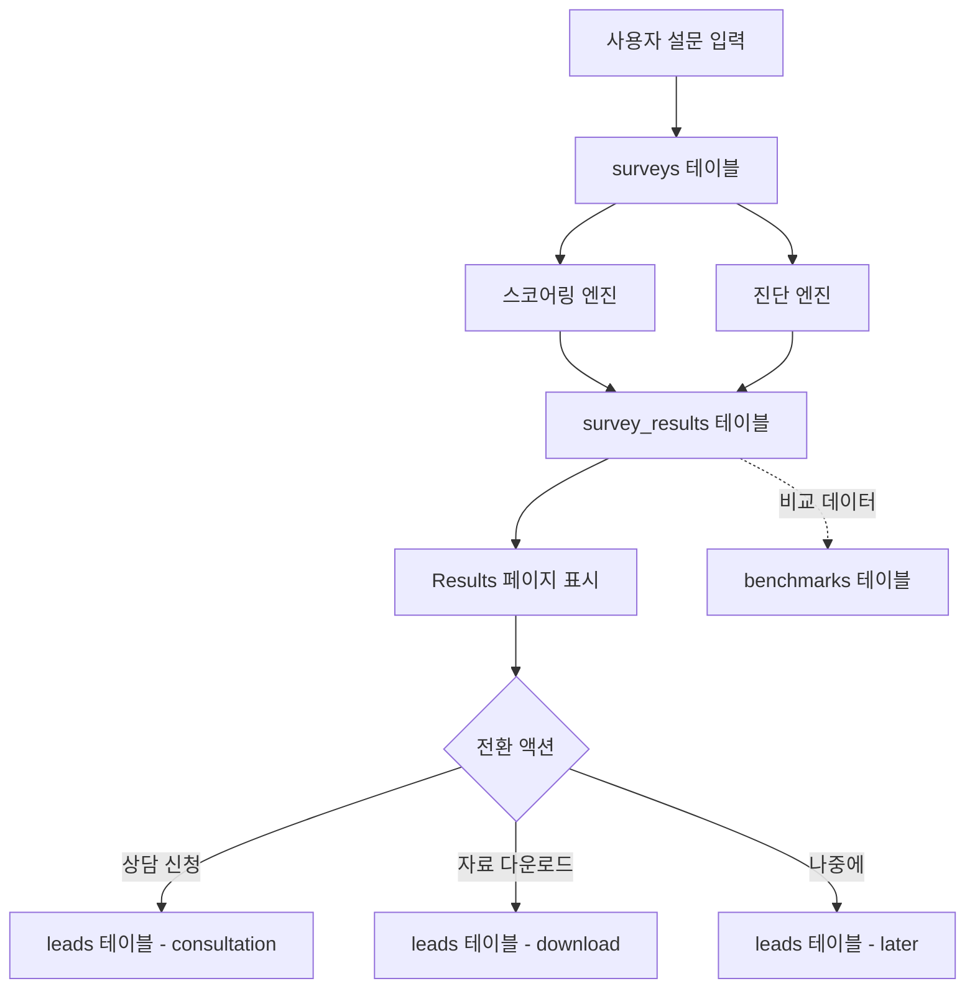

# Layer 1: 데이터 스키마 - DB 및 설문 데이터 구조

> **문서 목적**: 데이터베이스 스키마, 설문 질문 데이터, 타입 정의를 통합 관리합니다.  
> **참조 시점**: DB 마이그레이션, 설문 질문 수정, 새로운 필드 추가 시

---

## 1. 데이터 플로우



---

## 2. 데이터베이스 스키마

### 2.1 surveys (설문 응답)

**목적**: 사용자의 설문 응답을 저장

```sql
CREATE TABLE surveys (
  id UUID PRIMARY KEY DEFAULT gen_random_uuid(),
  created_at TIMESTAMP WITH TIME ZONE DEFAULT NOW(),
  
  -- Q1: 병원 위치와 규모
  location TEXT NOT NULL,
  hospital_size TEXT NOT NULL,
  
  -- Q2: 주요 진료 분야 (최대 2개)
  specialties TEXT[] NOT NULL,
  
  -- Q3: 월 마케팅 예산
  budget TEXT NOT NULL,
  
  -- Q4: 사용 중인 마케팅 채널
  channels TEXT[] NOT NULL,
  top1_channel TEXT NOT NULL,
  top2_channel TEXT,
  top3_channel TEXT,
  
  -- Q4-1: (조건부) 상업적 플랫폼 활용
  commercial_platform TEXT,
  
  -- Q4-2: 채널 선택 이유
  channel_reason TEXT NOT NULL,
  
  -- Q4-3: 채널별 비중
  top1_ratio TEXT NOT NULL,
  online_ratio TEXT NOT NULL,
  
  -- Q4-4: 다른 채널 시도 경험
  new_channel_attempt TEXT NOT NULL,
  
  -- Q4-5: 마케팅 관리 주체
  management TEXT NOT NULL,
  
  -- Q5-1: 신규 환자 파악 방법 (복수 선택)
  tracking_methods TEXT[] NOT NULL,
  
  -- Q6: 콘텐츠 업데이트 주기
  update_frequency TEXT NOT NULL,
  
  -- Q9: 온라인 현황 (복수 선택)
  online_status_positive TEXT[],
  online_status_negative TEXT[],
  
  -- Q10: 가장 큰 문제 (최대 2개)
  main_problems TEXT[] NOT NULL,
  
  -- 완료 상태
  completed BOOLEAN DEFAULT false,
  completed_at TIMESTAMP WITH TIME ZONE
);

CREATE INDEX idx_surveys_created_at ON surveys(created_at DESC);
CREATE INDEX idx_surveys_specialties ON surveys USING GIN(specialties);
CREATE INDEX idx_surveys_location ON surveys(location);
```

---

### 2.2 survey_results (진단 결과)

**목적**: 설문 응답에 대한 스코어링 및 진단 결과 저장

```sql
CREATE TABLE survey_results (
  id UUID PRIMARY KEY DEFAULT gen_random_uuid(),
  survey_id UUID NOT NULL REFERENCES surveys(id) ON DELETE CASCADE,
  created_at TIMESTAMP WITH TIME ZONE DEFAULT NOW(),
  
  -- 점수 (100점 만점)
  total_score INTEGER NOT NULL CHECK (total_score >= 0 AND total_score <= 100),
  
  -- 카테고리별 점수
  channel_score INTEGER NOT NULL,      -- 채널 활용도 (30점)
  operation_score INTEGER NOT NULL,    -- 운영 관리 (25점)
  measurement_score INTEGER NOT NULL,  -- 성과 측정 (25점)
  budget_score INTEGER NOT NULL,       -- 예산 규모 (20점)
  
  -- 레벨 (1-4)
  level INTEGER NOT NULL CHECK (level >= 1 AND level <= 4),
  
  -- 진단 결과
  primary_issue TEXT NOT NULL,         -- 주요 문제 유형
  secondary_issues TEXT[],             -- 부가 문제 (1-2개)
  
  -- 업종×지역 특성
  market_characteristics JSONB NOT NULL,
  
  -- 강점 영역
  strengths TEXT[],
  
  -- 비교 분석
  industry_avg_score INTEGER,          -- 업계 평균 점수
  percentile INTEGER,                  -- 상위 몇 %
  
  -- BEST CASE 비교
  best_case_id UUID,
  gap_analysis JSONB,
  
  -- 맞춤형 솔루션
  immediate_actions JSONB,             -- 즉시 실행 (72시간)
  short_term_plan JSONB,               -- 단기 개선안 (1개월)
  long_term_strategy JSONB,            -- 중장기 전략 (3-6개월)
  
  UNIQUE(survey_id)
);

CREATE INDEX idx_survey_results_survey_id ON survey_results(survey_id);
CREATE INDEX idx_survey_results_primary_issue ON survey_results(primary_issue);
CREATE INDEX idx_survey_results_total_score ON survey_results(total_score DESC);
```

---

### 2.3 leads (리드 정보)

**목적**: 사용자 연락처 및 전환 정보 관리

```sql
CREATE TABLE leads (
  id UUID PRIMARY KEY DEFAULT gen_random_uuid(),
  survey_id UUID NOT NULL REFERENCES surveys(id) ON DELETE CASCADE,
  created_at TIMESTAMP WITH TIME ZONE DEFAULT NOW(),
  
  -- 연락처 정보
  name TEXT,
  email TEXT,
  phone TEXT,
  hospital_name TEXT,
  
  -- 전환 유형
  conversion_type TEXT NOT NULL CHECK (
    conversion_type IN ('consultation', 'download', 'later', 'none')
  ),
  
  -- 상담 예약 정보 (consultation인 경우)
  consultation_date TIMESTAMP WITH TIME ZONE,
  consultation_status TEXT,
  
  -- 이메일 육성 상태
  nurture_stage INTEGER DEFAULT 0,     -- 0: 미시작, 1-7: Day 1-7
  last_email_sent_at TIMESTAMP WITH TIME ZONE,
  email_opens INTEGER DEFAULT 0,
  email_clicks INTEGER DEFAULT 0,
  
  -- 메모
  notes TEXT,
  
  UNIQUE(survey_id)
);

CREATE INDEX idx_leads_email ON leads(email);
CREATE INDEX idx_leads_conversion_type ON leads(conversion_type);
CREATE INDEX idx_leads_created_at ON leads(created_at DESC);
CREATE INDEX idx_leads_nurture_stage ON leads(nurture_stage);
```

---

### 2.4 benchmarks (벤치마크 데이터)

**목적**: 업종별/지역별 평균 및 BEST CASE 데이터 관리

```sql
CREATE TABLE benchmarks (
  id UUID PRIMARY KEY DEFAULT gen_random_uuid(),
  created_at TIMESTAMP WITH TIME ZONE DEFAULT NOW(),
  updated_at TIMESTAMP WITH TIME ZONE DEFAULT NOW(),
  
  -- 구분 기준
  specialty TEXT NOT NULL,             -- 진료과
  location TEXT NOT NULL,              -- 지역
  
  -- 평균 데이터
  avg_score INTEGER NOT NULL,
  avg_channel_count INTEGER,
  avg_budget TEXT,
  
  -- BEST CASE 데이터
  best_case_score INTEGER NOT NULL,
  best_case_story JSONB NOT NULL,      -- 성공 사례 스토리
  best_case_metrics JSONB NOT NULL,    -- 주요 지표
  best_case_strategies JSONB NOT NULL, -- 핵심 전략
  
  -- 통계
  sample_size INTEGER DEFAULT 0,       -- 표본 수
  
  UNIQUE(specialty, location)
);

CREATE INDEX idx_benchmarks_specialty ON benchmarks(specialty);
CREATE INDEX idx_benchmarks_location ON benchmarks(location);
```

---

### 2.5 RLS 정책 (비활성화)

사용자 요청에 따라 RLS 정책은 비활성화합니다.

```sql
-- RLS 비활성화
ALTER TABLE surveys DISABLE ROW LEVEL SECURITY;
ALTER TABLE survey_results DISABLE ROW LEVEL SECURITY;
ALTER TABLE leads DISABLE ROW LEVEL SECURITY;
ALTER TABLE benchmarks DISABLE ROW LEVEL SECURITY;
```

---

### 2.6 초기 데이터 (benchmarks 예시)

```sql
INSERT INTO benchmarks (
  specialty, 
  location, 
  avg_score, 
  best_case_score, 
  best_case_story, 
  best_case_metrics, 
  best_case_strategies, 
  sample_size
)
VALUES 
(
  '피부과/성형외과',
  '서울 강남권',
  52,
  89,
  '{
    "title": "강남 피부과 A병원 성공 스토리",
    "description": "네이버 의존도를 85%→40%로 줄이고 미용 플랫폼과 SNS를 적극 활용한 결과, 6개월 만에 신규 환자 150% 증가 달성"
  }',
  '{
    "monthly_patients": {"before": 150, "after": 380},
    "cac": {"before": 150000, "after": 70000},
    "online_booking_rate": {"before": 15, "after": 65}
  }',
  '["강남언니 프리미엄 광고 + 이벤트", "인스타 릴스 주 5회 업로드", "의사 출연 유튜브 쇼츠", "네이버는 효율적인 키워드만 집중"]',
  150
);
```

---

## 3. 설문 질문 데이터 구조

### 3.1 질문 개요

| 섹션 | 질문 ID | 질문 요약 | 타입 | 필수 |
|------|---------|-----------|------|------|
| 기본 정보 | Q1 | 병원 위치와 규모 | radio | ✅ |
| 기본 정보 | Q2 | 주요 진료 분야 (최대 2개) | checkbox | ✅ |
| 기본 정보 | Q3 | 월 마케팅 예산 | radio | ✅ |
| 마케팅 채널 | Q4 | 사용 중인 마케팅 채널 + TOP 3 | checkbox + ranking | ✅ |
| 마케팅 채널 | Q4-1 | 상업적 플랫폼 활용 (조건부) | radio | 조건부 |
| 마케팅 채널 | Q4-2 | 채널 선택 이유 | radio | ✅ |
| 마케팅 채널 | Q4-3 | 채널별 비중 | multi-select | ✅ |
| 마케팅 채널 | Q4-4 | 다른 채널 시도 경험 | radio | ✅ |
| 운영 관리 | Q4-5 | 마케팅 관리 주체 | radio | ✅ |
| 성과 측정 | Q5-1 | 신규 환자 파악 방법 | checkbox | ✅ |
| 운영 관리 | Q6 | 콘텐츠 업데이트 주기 | radio | ✅ |
| 성과 측정 | Q9 | 온라인 현황 | checkbox | ✅ |
| 개선 니즈 | Q10 | 가장 큰 문제 (최대 2개) | checkbox | ✅ |

---

### 3.2 Q1: 병원 위치와 규모

```typescript
{
  id: 'Q1',
  section: '기본 정보',
  title: '병원 위치와 규모를 선택해주세요',
  type: 'radio',
  fields: [
    {
      name: 'location',
      label: '지역 선택',
      options: [
        '🏢 서울 강남권 (강남/서초/송파)',
        '🏙️ 서울 비강남권',
        '🌆 경기/인천',
        '🌃 광역시 (부산/대구/광주/대전/울산)',
        '🏘️ 그 외 지역',
      ],
    },
    {
      name: 'hospital_size',
      label: '규모 선택',
      options: [
        '의원급 (병상 없음 또는 30개 미만)',
        '병원급 (병상 30-99개)',
        '종합병원급 이상 (병상 100개 이상)',
      ],
    },
  ],
}
```

---

### 3.3 Q2: 주요 진료 분야 (1순위, 2순위 선택)

```typescript
{
  id: 'Q2',
  section: '기본 정보',
  title: '주요 진료 분야를 선택해주세요',
  description: '1순위와 2순위를 선택해주세요 (2순위는 선택사항)',
  type: 'ranking',
  field: 'specialties',
  validation: { required: true, min: 1, max: 2 },
  options: [
    '💆 피부과/성형외과 (미용 중심)',
    '🦷 치과 (일반/교정/임플란트)',
    '🦴 정형외과/통증의학과/재활의학과',
    '🏥 내과/가정의학과 (일반 진료)',
    '👶 산부인과/소아청소년과',
    '👁️ 안과/이비인후과',
    '🧠 정신건강의학과/신경과',
    '🏥 기타 전문 진료과',
  ],
  // 특별 로직: 2순위가 '피부과/성형외과'인 경우, 
  // 조건부 질문(Q4-1)에서는 1순위로 처리됨
}
```

---

### 3.4 Q3: 월 마케팅 예산

```typescript
{
  id: 'Q3',
  section: '기본 정보',
  title: '현재 월 평균 마케팅 예산은 어느 정도인가요?',
  type: 'radio',
  field: 'budget',
  options: [
    '📍 100만원 미만',
    '📍 100-300만원',
    '📍 300-500만원',
    '📍 500-1,000만원',
    '📍 1,000-2,000만원',
    '📍 2,000만원 이상',
    '📍 정확히 모르겠음',
  ],
}
```

---

### 3.5 Q4: 사용 중인 마케팅 채널 + TOP 3

```typescript
{
  id: 'Q4',
  section: '마케팅 채널 현황',
  title: '현재 사용 중인 마케팅 채널을 모두 선택 후, 가장 비중이 큰 순서대로 3개를 선택해주세요',
  type: 'ranking',
  validation: { required: true, min: 1, max: 3 },
  fields: [
    {
      name: 'channels',
      type: 'checkbox',
      options: [
        '네이버 검색광고/파워링크',
        '네이버 플레이스 (스마트플레이스)',
        '카카오/다음 검색광고',
        '인스타그램 광고/운영',
        '페이스북 광고/운영',
        '유튜브 광고/채널 운영',
        '병원 홈페이지/블로그',
        '의료 플랫폼 (굿닥/모두닥/똑닥 등)',
        '미용 전문 플랫폼 (강남언니/바비톡 등)', // 피부과/성형외과만
        '오프라인 (현수막/전단지/신문 등)',
        '기타',
      ],
    },
    {
      name: 'top_channels',
      type: 'ranking',
      rankCount: 3,
      label: '가장 많이 투자하는 TOP 3 순위 매기기',
    },
  ],
}
```

---

### 3.6 Q4-1: 상업적 플랫폼 활용 (조건부)

**표시 조건**: Q2에서 "피부과/성형외과" 선택 시만 표시

**특별 로직**: 
- Q2에서 2순위가 '피부과/성형외과'인 경우에도 이 질문이 표시됨
- 설문 시스템에서 2순위가 '피부과/성형외과'일 경우 1순위로 처리

```typescript
{
  id: 'Q4-1',
  section: '마케팅 채널 현황',
  title: '상업적 플랫폼(강남언니/바비톡 등) 활용 여부',
  type: 'radio',
  field: 'commercial_platform',
  conditional: {
    field: 'specialties',
    values: ['피부과/성형외과'],
    // ranking 타입의 selected 배열에서 체크
    // 2순위가 '피부과/성형외과'인 경우에도 조건 충족으로 처리
  },
  options: [
    '유료 광고 적극 활용 중',
    '기본 정보만 등록',
    '사용하지 않음',
    '잘 모르겠음',
  ],
}
```

---

### 3.7 Q4-2: 채널 선택 이유

```typescript
{
  id: 'Q4-2',
  section: '마케팅 채널 현황',
  title: '현재 사용 중인 주력 채널을 선택한 이유는?',
  type: 'radio',
  field: 'channel_reason',
  options: [
    '📊 이전에 이 채널에서 성과가 좋았음',
    '💡 새롭게 시도해보고 있음',
    '👥 경쟁병원들이 많이 사용함',
    '💰 비용 대비 효율적임',
    '🎯 우리 환자층에 적합함',
    '🤷 특별한 이유 없음/관성적으로',
  ],
}
```

---

### 3.8 Q4-3: 채널별 비중

```typescript
{
  id: 'Q4-3',
  section: '마케팅 채널 현황',
  title: '각 채널별 비중을 대략적으로 선택해주세요',
  type: 'multi-select',
  subQuestions: [
    {
      id: 'top1_ratio',
      title: '1순위 채널의 비중은?',
      type: 'radio',
      options: [
        '⚫ 70% 이상 (거의 대부분)',
        '⚫ 50-70% (절반 이상)',
        '⚫ 30-50% (적당히)',
        '⚫ 30% 미만 (일부)',
      ],
    },
    {
      id: 'online_ratio',
      title: '온라인 vs 오프라인 비중은?',
      type: 'radio',
      options: [
        '온라인 100% : 오프라인 0%',
        '온라인 80% : 오프라인 20%',
        '온라인 60% : 오프라인 40%',
        '온라인 40% : 오프라인 60%',
        '온라인 20% : 오프라인 80%',
        '온라인 0% : 오프라인 100%',
      ],
    },
  ],
}
```

---

### 3.9 Q4-4: 다른 채널 시도 경험

```typescript
{
  id: 'Q4-4',
  section: '마케팅 채널 현황',
  title: '새로운 마케팅 채널 시도에 대한 생각은?',
  type: 'radio',
  field: 'new_channel_attempt',
  options: [
    '적극적으로 여러 채널을 테스트해봤음',
    '한두 개 정도 시도해봤지만 효과가 없어서 중단',
    '지금 채널만으로 충분해서 시도할 필요 없음',
    '시도하고 싶지만 방법을 모르겠음',
    '시도하고 싶지만 리소스(시간/예산)가 부족함',
  ],
}
```

---

### 3.10 Q4-5: 마케팅 관리 주체

```typescript
{
  id: 'Q4-5',
  section: '운영 관리',
  title: '마케팅 관리는 누가 하고 있나요?',
  type: 'radio',
  field: 'management',
  options: [
    '👤 원장/병원장이 직접',
    '👥 직원이 다른 업무와 함께',
    '👤 마케팅 전담 직원 있음',
    '🏢 외부 업체에 전체 위탁',
    '🤝 일부는 직접, 일부는 외부',
    '❓ 관리가 제대로 안되고 있음',
  ],
}
```

---

### 3.11 Q5-1: 신규 환자 파악 방법

```typescript
{
  id: 'Q5-1',
  section: '성과 측정',
  title: '마케팅을 통한 신규 환자를 어떻게 파악하나요?',
  description: '복수 선택 가능합니다',
  type: 'checkbox',
  field: 'tracking_methods',
  options: [
    '온라인 예약 시스템으로 자동 집계',
    '첫 방문 시 "어떻게 오셨나요?" 질문',
    '전화 예약 시 확인',
    '특정 이벤트/쿠폰으로 추적',
    '대략적으로 추정만 함',
    '따로 파악하지 않음',
  ],
}
```

---

### 3.12 Q6: 콘텐츠 업데이트 주기

```typescript
{
  id: 'Q6',
  section: '운영 및 관리 현황',
  title: '마케팅 콘텐츠(포스팅, 광고 등)는 얼마나 자주 업데이트하시나요?',
  description: '메인으로 사용하는 채널 기준',
  type: 'radio',
  field: 'update_frequency',
  options: [
    '📅 거의 매일 (주 5회 이상)',
    '📅 주 2-3회 정도',
    '📅 주 1회 정도',
    '📅 월 2-3회 정도',
    '📅 월 1회 이하',
    '📅 만들어놓고 거의 안함',
  ],
}
```

---

### 3.11 Q7: 마케팅 관리 주체

```typescript
{
  id: 'Q7',
  section: '운영 및 관리 현황',
  title: '마케팅 관리는 누가 하고 있나요?',
  type: 'radio',
  field: 'management',
  options: [
    '👤 원장/병원장이 직접',
    '👥 직원이 다른 업무와 함께',
    '👤 마케팅 전담 직원 있음',
    '🏢 외부 업체에 전체 위탁',
    '🤝 일부는 직접, 일부는 외부',
    '❓ 관리가 제대로 안되고 있음',
  ],
}
```

---

### 3.12 Q8: 신규 환자 파악 방법

```typescript
{
  id: 'Q8',
  section: '성과 측정',
  title: '마케팅을 통한 신규 환자를 어떻게 파악하나요?',
  description: '복수선택 가능',
  type: 'checkbox',
  field: 'tracking_methods',
  options: [
    '온라인 예약 시스템으로 자동 집계',
    '첫 방문 시 "어떻게 오셨나요?" 질문',
    '전화 예약 시 확인',
    '특정 이벤트/쿠폰으로 추적',
    '대략적으로 추정만 함',
    '따로 파악하지 않음',
  ],
}
```

---

### 3.13 Q9: 온라인 현황

```typescript
{
  id: 'Q9',
  section: '성과 측정',
  title: '현재 온라인에서 우리 병원은 어떤 상태인가요?',
  description: '복수선택 가능',
  type: 'checkbox',
  fields: [
    {
      name: 'online_status_positive',
      label: '긍정 신호',
      options: [
        '네이버에서 우리 병원 검색하면 바로 나옴',
        '네이버 플레이스 평점 4.0 이상',
        '인스타그램 팔로워 1,000명 이상',
        '매달 온라인 문의가 꾸준히 옴',
        '경쟁 병원보다 검색 순위가 높음',
      ],
    },
    {
      name: 'online_status_negative',
      label: '부정 신호',
      options: [
        '검색해도 잘 안 나옴',
        '리뷰가 별로 없거나 평점이 낮음',
        'SNS 반응이 거의 없음',
        '온라인 문의가 거의 없음',
        '잘 모르겠음',
      ],
    },
  ],
}
```

---

### 3.14 Q10: 가장 큰 문제

```typescript
{
  id: 'Q10',
  section: '개선 니즈',
  title: '현재 마케팅에서 가장 큰 문제는 무엇인가요?',
  description: '최대 2개까지 선택 가능',
  type: 'checkbox',
  maxSelections: 2,
  field: 'main_problems',
  options: [
    // 효과 문제
    '💭 광고비는 쓰는데 환자가 안 늘어남',
    '💭 효과가 있는지 없는지 모르겠음',
    // 방법 문제
    '💭 어디에 어떻게 광고해야 할지 모르겠음',
    '💭 너무 많은 채널이 있어 혼란스러움',
    // 경쟁 문제
    '💭 경쟁 병원이 너무 많아 차별화가 어려움',
    '💭 광고 단가가 너무 비쌈',
    // 자원 문제
    '💭 마케팅할 시간/인력이 부족함',
    '💭 예산이 부족함',
  ],
}
```

---

## 4. TypeScript 타입 정의

### 4.1 Survey 관련 타입

```typescript
// src/types/survey.ts

export interface SurveyResponse {
  // Q1
  location: string;
  hospital_size: string;
  
  // Q2
  specialties: string[];
  
  // Q3
  budget: string;
  
  // Q4
  channels: string[];
  top1_channel: string;
  top2_channel?: string;
  top3_channel?: string;
  
  // Q4-1 (조건부)
  commercial_platform?: string;
  
  // Q4-2
  channel_reason: string;
  
  // Q4-3
  new_channel_attempt: string;
  
  // Q5
  top1_ratio: string;
  online_ratio: string;
  
  // Q6
  update_frequency: string;
  
  // Q7
  management: string;
  
  // Q8
  tracking_methods: string[];
  
  // Q9
  online_status_positive: string[];
  online_status_negative: string[];
  
  // Q10
  main_problems: string[];
}

export interface SurveyResult {
  id: string;
  survey_id: string;
  
  // 점수
  total_score: number;
  channel_score: number;
  operation_score: number;
  measurement_score: number;
  budget_score: number;
  level: 1 | 2 | 3 | 4;
  
  // 진단
  primary_issue: string;
  secondary_issues: string[];
  market_characteristics: MarketCharacteristics;
  strengths: string[];
  
  // 비교
  industry_avg_score?: number;
  percentile?: number;
  best_case_id?: string;
  gap_analysis?: GapAnalysis;
  
  // 솔루션
  immediate_actions: Action[];
  short_term_plan: Action[];
  long_term_strategy: Action[];
  
  created_at: string;
}

export interface MarketCharacteristics {
  competition: string;
  key_channels: string[];
  avg_budget: string;
  critical_success_factor: string;
}

export interface GapAnalysis {
  total_gap: number;
  channel_gap: number;
  operation_gap: number;
  measurement_gap: number;
}

export interface Action {
  title: string;
  description: string;
  priority: 'high' | 'medium' | 'low';
}

export interface Lead {
  id: string;
  survey_id: string;
  name?: string;
  email?: string;
  phone?: string;
  hospital_name?: string;
  conversion_type: 'consultation' | 'download' | 'later' | 'none';
  consultation_date?: string;
  consultation_status?: string;
  nurture_stage: number;
  created_at: string;
}

export interface Benchmark {
  id: string;
  specialty: string;
  location: string;
  avg_score: number;
  best_case_score: number;
  best_case_story: {
    title: string;
    description: string;
  };
  best_case_metrics: Record<string, any>;
  best_case_strategies: string[];
  sample_size: number;
}
```

---

### 4.2 Question 관련 타입

```typescript
export type QuestionType = 
  | 'radio' 
  | 'checkbox' 
  | 'ranking' 
  | 'multiselect' 
  | 'dropdown';

export interface Question {
  id: string;
  section: string;
  title: string;
  description?: string;
  type: QuestionType;
  field?: string;
  fields?: QuestionField[];
  options?: string[];
  maxSelections?: number;
  conditional?: {
    field: string;
    includes: string;
  };
}

export interface QuestionField {
  name: string;
  label?: string;
  type?: string;
  options: string[];
  rankCount?: number;
}
```

---

## 5. 마이그레이션 순서

1. **surveys 테이블 생성**
2. **survey_results 테이블 생성**
3. **leads 테이블 생성**
4. **benchmarks 테이블 생성**
5. **인덱스 생성**
6. **초기 벤치마크 데이터 삽입**
7. **RLS 비활성화 확인**

---

## 변경 이력

| 날짜 | 변경 내용 | 작성자 |
|------|-----------|--------|
| 2025-01-XX | 초기 문서 작성 (3-Layer 구조 전환) | - |
