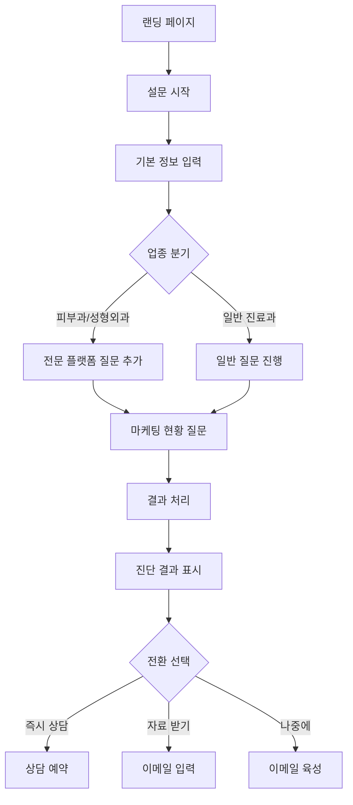
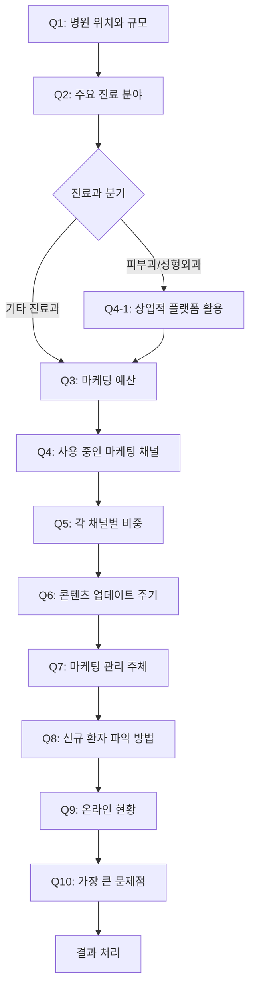
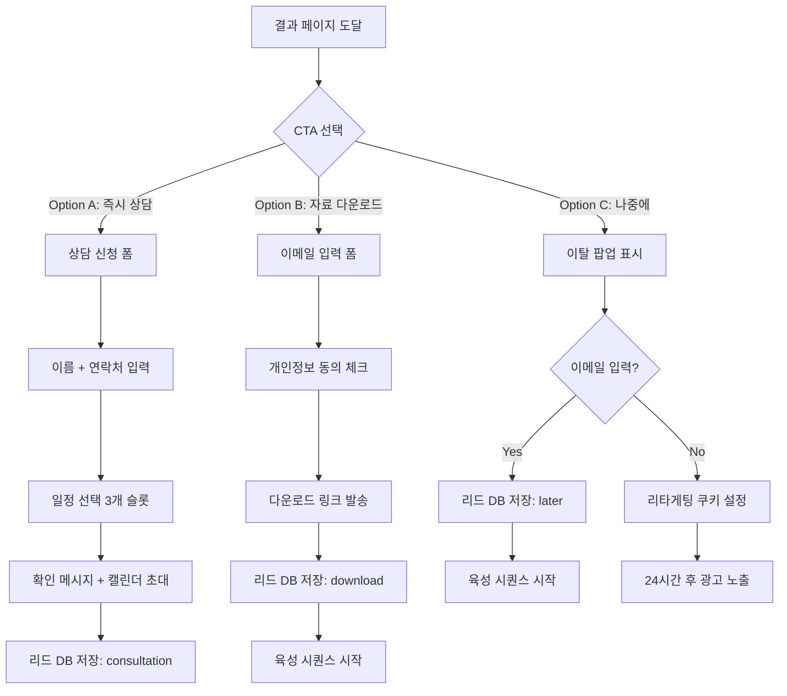
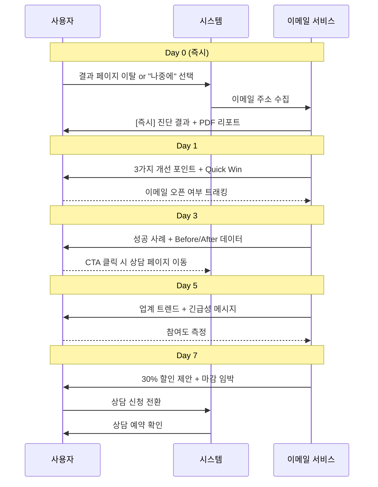

# UserFlow - 병원 마케팅 설문 서비스

## 1. 전체 플로우 개요

## 2. 상세 유저 플로우

### 2.1 진입 단계

#### Step 0: 랜딩 페이지 도착
- **화면**: 헤드라인 "3분만에 우리 병원 마케팅 진단받기"
- **행동**: [시작하기] 버튼 클릭
- **분기**: 없음
- **이탈 방지**: 간단함 강조, 시간 명시

### 2.2 설문 단계

#### 설문 조건부 분기 플로우

#### Step 1: 기본 정보 (3문항)

##### Q1. 병원 위치와 규모
- **입력 방식**: 드롭다운 2개 (지역 + 규모)
- **검증**: 필수 선택
- **자동 처리**: 시장 경쟁도 계산

##### Q2. 주요 진료 분야
- **입력 방식**: 체크박스 (최대 2개)
- **검증**: 최소 1개, 최대 2개
- **분기 로직**: 
  - 피부과/성형외과 선택 → Q4-1 추가
  - 기타 진료과 → Q4-1 스킵

##### Q3. 월 마케팅 예산
- **입력 방식**: 라디오 버튼
- **검증**: 필수 선택
- **자동 처리**: 투자 수준 판단

#### Step 2: 마케팅 현황 (5문항)

##### Q4. 사용 중인 마케팅 채널
- **입력 방식**: 
  1. 체크박스로 사용 채널 선택
  2. TOP 3 순위 드롭다운
- **검증**: 
  - 최소 1개 채널 선택
  - TOP 3는 선택한 채널 내에서만
- **자동 처리**: 채널 의존도 계산

##### Q4-1. (조건부) 상업적 플랫폼 활용
- **표시 조건**: Q2에서 피부과/성형외과 선택 시
- **입력 방식**: 라디오 버튼
- **자동 처리**: 온라인 적극성 판단

##### Q4-2. 마케팅 채널 선택 이유
- **입력 방식**: 라디오 버튼 (단일 선택)
- **자동 처리**: 원툴형 판단 근거

##### Q4-3. 다른 채널 시도 경험
- **입력 방식**: 라디오 버튼
- **자동 처리**: 원툴형 판단 근거

##### Q5. 각 채널별 비중
- **입력 방식**: 
  - TOP 1 채널 비중 선택
  - 온라인 vs 오프라인 슬라이더
- **자동 처리**: 디지털 전환 수준 계산

##### Q6. 콘텐츠 업데이트 주기
- **입력 방식**: 라디오 버튼
- **자동 처리**: 운영 수준 판단

##### Q7. 마케팅 관리 주체
- **입력 방식**: 라디오 버튼
- **자동 처리**: 관리 체계 평가

#### Step 3: 성과 측정 (2문항)

##### Q8. 신규 환자 파악 방법
- **입력 방식**: 체크박스 (복수 선택)
- **자동 처리**: 측정 역량 평가

##### Q9. 온라인 현황
- **입력 방식**: 체크박스 (긍정/부정 신호)
- **자동 처리**: 디지털 존재감 평가

#### Step 4: 개선 니즈 (1문항)

##### Q10. 가장 큰 문제점
- **입력 방식**: 체크박스 (최대 2개)
- **자동 처리**: 주요 니즈 파악

### 2.3 결과 단계

#### Step 5: 진단 처리
- **화면**: 로딩 애니메이션 (2-3초)
- **백엔드 처리**:
  1. 점수 계산
  2. 유형 진단
  3. 비교 분석
  4. 솔루션 매칭

#### Step 6: 결과 표시

##### 섹션 1: 종합 점수
- **표시 내용**: 
  - 점수 (시각적 게이지)
  - 업계 평균 비교
  - 레벨 표시

##### 섹션 2: 진단 결과
- **표시 내용**:
  - 주요 문제 유형
  - 부가 문제
  - 업종×지역 특성
  - 강점 영역

##### 섹션 3: BEST CASE 비교
- **표시 내용**:
  - 성공 사례 스토리
  - 격차 분석 (막대 그래프)
  - 달성 가능성 %

##### 섹션 4: 맞춤 솔루션
- **표시 내용**:
  - 즉시 실행 과제 (72시간)
  - 단기 개선안 (1개월)
  - 중장기 전략 (3-6개월)

### 2.4 전환 단계

#### 전환 프로세스 플로우

#### Step 7: CTA 제시

##### Option A: 즉시 전환
- **트리거**: [지금 상담 신청] 클릭
- **프로세스**:
  1. 간단 정보 입력 (이름, 연락처)
  2. 일정 선택 (3개 슬롯)
  3. 확인 메시지

##### Option B: 자료 다운로드
- **트리거**: [자료 받기] 클릭
- **프로세스**:
  1. 이메일 입력
  2. 개인정보 동의
  3. 다운로드 링크 발송

##### Option C: 나중에 결정
- **트리거**: [다음에] 클릭 or 이탈
- **프로세스**:
  1. 이메일 입력 유도 팝업
  2. 7일 육성 시퀀스 시작

## 3. 이메일 육성 플로우

### 이메일 육성 시퀀스 다이어그램

### Day 0 (즉시)
- **제목**: "병원 마케팅 진단 결과가 도착했습니다"
- **내용**: 
  - 진단 요약
  - 상세 리포트 PDF 첨부
  - 즉시 실행 팁 1개

### Day 1
- **제목**: "놓치면 안 되는 3가지 개선 포인트"
- **내용**:
  - Top 3 개선 영역 상세 설명
  - 각 영역별 Quick Win
  - 무료 상담 CTA

### Day 3
- **제목**: "[사례] OO과 병원이 3개월 만에 달성한 성과"
- **내용**:
  - 유사 케이스 성공 사례
  - Before/After 데이터
  - 적용 가능한 전략

### Day 5
- **제목**: "경쟁병원들은 이미 시작했습니다"
- **내용**:
  - 업계 트렌드 리포트
  - 경쟁병원 활동 사례
  - 긴급성 메시지

### Day 7
- **제목**: "30% 할인 마지막 기회"
- **내용**:
  - 시간 제한 오퍼
  - 패키지 상세 설명
  - 1:1 상담 예약 링크

## 4. 예외 처리

### 4.1 이탈 시나리오

#### 설문 중 이탈
- **10초 후**: 팝업 "잠깐! 2분만 더 투자하세요"
- **복귀 시**: 이어서 진행 가능

#### 결과 확인 후 이탈
- **즉시**: 이메일 입력 유도 팝업
- **24시간 후**: 리타게팅 광고 시작

### 4.2 오류 처리

#### 필수 문항 미입력
- **표시**: 빨간색 테두리 + 안내 메시지
- **진행**: 다음 단계 진행 불가

#### 서버 오류
- **표시**: "잠시 후 다시 시도해주세요"
- **처리**: 입력 내용 임시 저장

## 5. 모바일 최적화

### 터치 인터페이스
- 버튼 최소 크기: 44×44px
- 스크롤 대신 스와이프 지원
- 하단 고정 CTA 버튼

### 입력 간소화
- 드롭다운 → 큰 버튼 그리드
- 체크박스 → 토글 버튼
- 자동 스크롤 to 다음 질문

## 6. 성과 추적 포인트

### 퍼널 분석
1. 랜딩 → 설문 시작: 목표 70%
2. 설문 시작 → 완료: 목표 60%
3. 결과 확인 → CTA 클릭: 목표 40%
4. CTA 클릭 → 전환: 목표 15%

### 드롭오프 분석
- 각 질문별 이탈률
- 평균 체류 시간
- 재방문 패턴

### A/B 테스트 포인트
- CTA 문구
- 질문 순서
- 결과 페이지 구성
- 이메일 제목/내용
